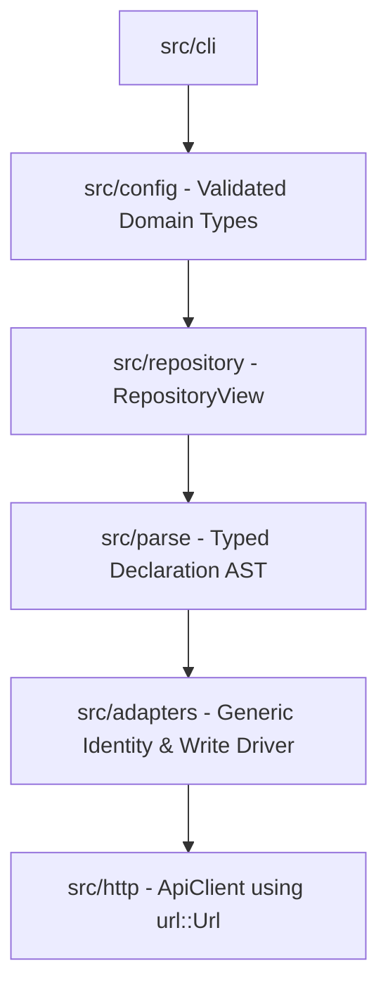

# Principal Rust Architecture Review

## Executive summary

The codebase is security-conscious and heavily specification-driven, but it has accumulated substantial accidental complexity. The central architectural issue is that validation produces `serde_json::Value`, after which most of the application repeatedly rediscovers schema invariants using JSON pointers, string keys, and runtime “evidence” checks.

Approximately 21,000 lines of Rust are concentrated in a few very large modules. `save`, `workflow`, `projection`, and `http` are the main complexity centers.

## Principal findings

### 1. Dynamic JSON is replacing the domain model — high severity

`ParsedDeclaration` publicly exposes both an independently stored `kind` and an unrestricted `serde_json::Value` in `src/parse/mod.rs`.

Downstream code then repeatedly calls `pointer`, `as_str`, `as_array`, and indexes fields by string. This causes:

- Runtime checks for invariants already established by schema validation.
- Potential disagreement between `ParsedDeclaration.kind` and `value["kind"]`.
- Weak encapsulation: any internal caller can mutate or manufacture a declaration.
- Large projection and reverse-projection modules built around map surgery.
- Errors appearing far from their actual boundary.

This conflicts directly with the repository rule that Serde/config structs be converted immediately into validated command/domain types.

#### Recommendation

Introduce a closed declaration model:

```rust
enum Declaration {
    Assistant(AssistantDeclaration),
    Workflow(WorkflowDeclaration),
    Skill(SkillDeclaration),
    Datasource(DatasourceDeclaration),
}
```

Give each entity typed metadata and spec structures, with newtypes such as `ProjectName`, `Slug`, `SkillName`, `ServerId`, and `RepoName`. Preserve `Value` only where the upstream API genuinely permits an open JSON extension object.

JSON Schema can remain as an initial compatibility gate, but successful schema validation should be followed immediately by deserialization and semantic conversion into domain types.

### 2. The prepared-write proof object is severe over-engineering

The adapter layer in `src/adapters/mod.rs` encodes a long chain of runtime evidence types:

- `ResolutionTarget`
- `WriteAbilityEvidence`
- Single-variant `OperationPreflight`
- Four `CompletedResolution` wrappers
- `PrewriteEvidence`
- `PreparedWrite`
- `PreparedRequest`
- `PreparedWriteResponse`

The same invariants are checked while sealing and then checked again while consuming the seal. `OperationPreflight` currently has one variant, yet is matched as if it were an extensible hierarchy.

These objects do not establish strong compile-time guarantees because their important relationships—entity kind, project, server ID, and request shape—are still strings and dynamic JSON. They mostly move runtime assertions between modules.

#### Recommendation

- Let an entity-specific application service own the sequence `authorize → resolve → project → write`.
- Return an entity-specific `CreateRequest` or `UpdateRequest`.
- Keep raw modifying HTTP methods private to the transport module.
- Express write authorization as a capability result or ordinary successful control flow, rather than stored evidence.
- Remove duplicated invariant checks unless state can actually change between them.

A private transport API plus cohesive application services provides the encapsulation benefit without the proof-object hierarchy.

### 3. Projection has a misleading and overly broad API

`project` and `project_with_workflow_references` in `src/projection/mod.rs` accept parameters prefixed with `_` that are forwarded or unused.

The abstraction attempts to provide one projection signature for four entities even though they need different inputs. It also leaks transport decisions—create, update, and multipart query parameters—into what is described as domain projection.

#### Recommendation

Replace the universal function with entity-specific operations:

```rust
assistant::create_request(&AssistantDeclaration)
workflow::update_request(
    &WorkflowDeclaration,
    &WorkflowServerState,
    &ResolvedReferences,
)
datasource::create_request(&DatasourceDeclaration, &LoadedFiles)
```

This eliminates irrelevant parameters and lets each request type encode exactly what it requires.

### 4. The transport boundary is internally inconsistent

`ApiClient` in `src/http/mod.rs` stores a `base_url`, but every operation accepts another `ValidatedUrl` argument. The stored field is consequently marked as dead code.

This weakens the central security claim that the client is bound to a validated origin. Callers can select another URL for every request.

The transport also contains repeated GET retry loops and separate but largely duplicated POST/PUT processing.

#### Recommendation

- Bind `ApiClient` to one origin and remove URL parameters from methods.
- Represent endpoint paths with a small internal endpoint/path builder.
- Centralize response-size, status, JSON, and retry processing.
- Keep HTTP DTOs in entity-specific API modules rather than returning `Value`.

### 5. Output state permits invalid combinations

`Outcome` in `src/output/mod.rs` represents entity identity using a `kind: String` plus three optional natural-key fields.

Invalid states are representable—for example, `"Skill"` plus `slug`, or an arbitrary kind—and `write()` silently returns if reconstruction fails. It also discards all renderer I/O errors.

#### Recommendation

```rust
enum OutcomeIdentity {
    Assistant { project: ProjectName, slug: Slug },
    Workflow { project: ProjectName, slug: Slug },
    Skill { project: ProjectName, name: SkillName },
    Datasource { project: ProjectName, repo_name: RepoName },
}
```

Serialize this through a dedicated boundary DTO. Make output methods return `io::Result<()>`; output failure should not masquerade as success.

### 6. Error encapsulation is too coarse

`AppError` in `src/error.rs` is a monolithic enum whose variants mostly contain `String`.

This loses source errors and structured context early, even though the output renderer later intentionally redacts them. Internal diagnostics and external error disclosure should be separate concerns.

#### Recommendation

- Define errors near their owners: `ParseError`, `ConfigError`, `TransportError`, `ReconciliationError`, and `SaveError`.
- Preserve safe typed context and `#[source]` chains internally.
- Convert errors into a closed `CliDiagnostic` only at the rendering boundary.
- Avoid mapping unrelated filesystem failures to `EntityNotExportable`; retain the cause internally.

### 7. Excessive `map_err` is a symptom of missing layer errors — high severity

There are 71 production/test-module `map_err` call sites across the Rust source. The largest concentrations are `discovery` (14), `save` (10), `http` (10), and `auth` (6). Many closures discard the source error and manufacture an `AppError` containing a string.

`map_err` is not intrinsically unidiomatic. It is the correct tool when a call site must:

- Add operation-specific context.
- Classify the same external error differently according to read/write semantics.
- Redact information at an external presentation boundary.
- Recover, observe, or select a semantic error variant.

For example, a `reqwest::Error` during a GET can mean connectivity failure, while the same error after dispatching a modifying request can mean an uncertain write. A single global `From<reqwest::Error> for AppError` would erase that crucial distinction. The explicit mapping at those dispatch boundaries is justified.

Most other sites exist because every subsystem returns the global `AppError` directly. There is no coherent one-to-one conversion such as `From<ConfigError> for AppError`, because `ConfigError`, `ParseError`, `TransportError`, `FilesystemError`, and `SaveError` do not exist yet.

#### Recommended error hierarchy

```rust
#[derive(Debug, thiserror::Error)]
enum ConfigError {
    #[error("failed to load configuration")]
    Load(#[source] config::ConfigError),

    #[error("invalid target URL")]
    InvalidUrl(#[source] url::ParseError),
}

#[derive(Debug, thiserror::Error)]
enum ParseError {
    #[error("invalid YAML declaration")]
    Yaml(#[from] yaml_serde::Error),

    #[error("schema engine failure")]
    SchemaEngine(#[source] jsonschema::ValidationError<'static>),

    #[error("sidecar is not UTF-8")]
    SidecarUtf8(#[from] std::string::FromUtf8Error),
}

#[derive(Debug, thiserror::Error)]
enum TransportError {
    #[error("request failed before a response was received")]
    Send(#[source] reqwest::Error),

    #[error("response body could not be read")]
    ReadBody(#[source] reqwest::Error),

    #[error("response JSON is invalid")]
    Decode(#[source] serde_json::Error),
}

#[derive(Debug, thiserror::Error)]
enum AppError {
    #[error(transparent)]
    Config(#[from] ConfigError),

    #[error(transparent)]
    Parse(#[from] ParseError),

    #[error(transparent)]
    Transport(#[from] TransportError),

    // Truly application-level variants remain here.
    #[error("write outcome is uncertain")]
    WriteUncertain(#[source] TransportError),
}
```

The exact variants should follow the approved diagnostic taxonomy, but the ownership principle is important: the layer that understands the failure owns its typed error; the application boundary converts that error once.

#### Conversion policy

- Use `#[from]` for canonical, context-free, one-to-one conversions.
- Use `#[source]` without `#[from]` when construction requires context or semantic classification.
- Use `?` for propagation after a suitable conversion exists.
- Use a named constructor or `map_err` only when adding context or changing semantics.
- Preserve source errors internally. Redact them when producing `CliDiagnostic`, not when the error first occurs.
- Do not implement broad `From<std::io::Error> for AppError`; an I/O error means different things in configuration, declaration discovery, sidecar loading, and atomic publication.

#### Representative cleanup opportunities

- Configuration file I/O and parsing should become `ConfigError` and propagate with `?`.
- YAML/JSON conversion and UTF-8 failures should become `ParseError` variants rather than immediately becoming strings.
- Serialization failures in projection should become a typed `ProjectionError`; many are invariant failures and should remain distinguishable from invalid server input.
- Filesystem operations should carry a safe operation/path classification in `FilesystemError`, with the original `io::Error` as source.
- Tokio task join failures should convert through a typed worker error; cancellation and panic should not both become the same fixed internal string.
- HTTP response decoding should preserve `serde_json::Error` internally while the renderer emits only the approved safe API-incompatible diagnostic.

The goal is not zero `map_err` calls. The goal is for the remaining calls to mark real semantic boundaries. A substantial majority of current mechanical mappings should disappear into `thiserror` conversions and ordinary `?` propagation.

### 8. Ad hoc validation and extraction should become boundary conversions — high severity

The codebase has only a small number of `From`, `TryFrom`, and `FromStr` implementations, while many helpers perform canonical representation changes or validate a raw value and then continue circulating the original type. This permits callers to bypass validation and causes the same extraction logic to be repeated.

#### Strong conversion candidates

| Current pattern | Idiomatic replacement |
|---|---|
| `SaveCommand::validate(self) -> Result<Self, AppError>` | `TryFrom<RawSaveCommand> for SaveCommand`, where only the validated type enters `save`. |
| Public `ApplyCommand` containing raw strings, paths, and options | `TryFrom<RawApplyCommand> for ApplyCommand` with typed URL, token, selector, repository root, and declaration path. |
| `target_identity(&ParsedDeclaration)` plus repeated `required_string` | `TryFrom<&Declaration> for TargetIdentity`; with a typed declaration enum this should become infallible `From<&Declaration>`. |
| `select_auth_mode(&Credentials, auth_url)` plus `effective_client_id` | `TryFrom<AuthSelectionInput> for AuthStrategy`, with enum variants carrying exactly the credentials required by that mode. |
| `normalize_companion_path(&str) -> Result<String, _>` | `FromStr for CompanionPath` or `TryFrom<&str>`, storing normalized path components rather than returning another raw `String`. |
| `check_basename_safety(&str) -> Result<(), _>` | `TryFrom<&str> for SafeFileName`; downstream multipart code accepts only `SafeFileName`. |
| Manual UUID predicate and later raw selector string | `FromStr`/`TryFrom<&str>` for `WorkflowId`, internally backed by `uuid::Uuid`. |
| `validate_output_path(repo_root, path) -> PathBuf` | `TryFrom<OutputPathInput<'_>> for NewOutputPath`; the result owns the proven repository-contained path. |
| `validate_skill_detail(&Value) -> Result<(), _>` followed by continued use of the same `Value` | `TryFrom<Value> for SkillDetailResponse` using a typed OpenAPI DTO. |
| `validate_workflow_detail` and pagination validators | Deserialize/TryFrom into operation-specific response and `Pagination` types whose constructors enforce invariants. |
| `extract_id(&Value) -> String` | Typed response DTO conversion; where the contract has no ID, remove extraction and re-resolve identity. |
| `extract_entity_kind(&Value)` | Serde-tagged `Declaration` enum; otherwise `TryFrom<&Value> for EntityKind`. |
| `parse_strict_json(&str)` | `FromStr for StrictJsonValue`, implemented once and shared by HTTP and Workflow code. |
| `ref_pair(value, key_field)` | `TryFrom<&ReferenceDto> for NaturalReference`, with typed variants for assistant, skill, and datasource keys. |
| Manual `ApplyAction` to output `Action` match | `From<ApplyAction> for Action`. |
| Multiple `Outcome::new_*` constructors | `From<(Action, OutcomeIdentity)> for OutcomeDto`, or serialize `OutcomeIdentity` directly. |
| Repository config DTO followed by separate resolution helpers | `TryFrom<LayeredConfigDto> for AppConfig`, producing validated domain fields once. |

The current `SaveCommand::validate` pattern is especially problematic: both validated and unvalidated commands have the same type, so the compiler cannot prevent `save(raw_command)` or future callers from skipping validation. Returning a distinct type is the important improvement, not merely renaming the method.

#### Authentication should encode valid combinations

`Credentials` currently permits every combination of five optional values, and `AuthMode` is stored separately. This creates many invalid states and requires `select_auth_mode` plus `effective_client_id` to interpret them repeatedly.

A boundary conversion should instead produce:

```rust
enum AuthStrategy {
    Bearer {
        token: SecretString,
    },
    ClientCredentials {
        auth_url: ValidatedAuthUrl,
        client_id: ClientId,
        client_secret: SecretString,
    },
    ResourceOwnerPassword {
        auth_url: ValidatedAuthUrl,
        client_id: ClientId,
        email: Email,
        password: SecretString,
    },
    Local {
        email: Email,
        password: SecretString,
    },
}

impl TryFrom<AuthSelectionInput> for AuthStrategy { /* precedence + validation */ }
```

After conversion, an authentication operation cannot observe “ROPC mode without a password” or “client credentials without an auth URL.”

#### Helpers that should remain named functions

Not every transformation belongs in a standard conversion trait. Keep named functions when the result depends on workflow policy or external context rather than one canonical source representation:

- Repository discovery and `load_target_declaration` perform I/O, cancellation, graph validation, and selection; they are workflows, not conversions.
- Projection may remain named when it requires server state, resolved references, create/update policy, or loaded sidecars. A `TryFrom<ProjectionInput>` is possible but not inherently clearer.
- `classify_marker` compares a parsed marker with desired project, slug, creator, and row context. Parsing the marker can be `FromStr`; contextual classification should remain named.
- Retry/status classification depends on HTTP method and whether mutation dispatch began; it should remain an explicit policy function.
- Canonical YAML serialization is a fallible formatting operation with policy, so a named serializer is clearer than `Display` or `From`.
- Precedence resolution across CLI, environment, `.env`, and file sources is a workflow. Only the final DTO-to-domain validation should be `TryFrom`.

#### Conversion design rules

- Implement `From` only when conversion is infallible, canonical, and unsurprising.
- Implement `TryFrom`/`FromStr` when one raw representation becomes one validated domain value.
- Do not use `From` for conversions that can lose information or silently apply policy.
- Avoid `TryFrom<serde_json::Value>` as the final architecture when a Serde DTO can deserialize directly; use DTO-to-domain `TryFrom` instead.
- Conversion success must retire the raw value. Do not validate a `String` and then return the same `String` type.
- Prefer borrowed conversions such as `TryFrom<&RawDto>` only when cloning is genuinely avoidable; otherwise consume the DTO and transfer its owned fields.

### 9. Lint enforcement and crate structure — high severity

#### What is currently enforced

`make lint` runs:

```text
cargo clippy --all-targets -- -D warnings
```

When that target is executed, all rustc and Clippy lints that are enabled at warning level become hard errors. Because rustc's `dead_code` lint warns by default, ordinary compiled dead code is rejected by this command.

However, the policy is incomplete:

- There is no `[lints.rust]` or `[lints.clippy]` policy in `Cargo.toml`.
- There are no crate-level `#![deny(...)]` declarations.
- `missing_docs` is allow-by-default and is therefore not enabled by `-D warnings`.
- Clippy `pedantic`, `nursery`, and selected restriction lints are not enabled by `make lint`.
- Formatting is not checked. `make format` modifies files using `cargo fmt --all`; CI does not run `cargo fmt --all -- --check`.
- There are explicit `dead_code` allowances in `render`, `http`, and `parse`. Some are justified contract-completeness exceptions, but they mean absence of dead code is not absolute.
- `#[allow(dead_code)]` on the unused `ApiClient.base_url` masks an actual design defect rather than a contract-required item.

More importantly, the GitLab build job that invokes `make lint` is guarded by production-apply rules. Based on the checked-in `.gitlab-ci.yml`, it does not run for every ordinary branch or merge-request pipeline. Strict linting exists as a Make target and production-build gate, but it is not a universal repository CI gate.

#### Documentation enforcement

Documentation is not currently required. `-D warnings` does not activate `missing_docs`; it only upgrades lints already enabled at warning level.

Recommended policy:

```toml
[lints.rust]
dead_code = "deny"
missing_docs = "deny"
unsafe_code = "forbid"

[lints.clippy]
all = { level = "deny", priority = -1 }
pedantic = { level = "warn", priority = -1 }
```

Apply exceptions locally with a precise `reason`. Do not require prose documentation for every private helper merely to satisfy a metric; enforce `missing_docs` for the public library API and use selected Clippy documentation lints where they add value.

Add an unconditional merge-request/branch quality job running:

```text
cargo fmt --all -- --check
cargo clippy --locked --all-targets --all-features -- -D warnings
cargo test --locked --all-targets --all-features
```

The production deployment job should depend on this quality job rather than being the only place that executes it.

#### Missing `lib.rs`

The package is binary-only: `src/main.rs` declares every module and owns the complete application. There is no library target. This has several consequences:

- Tests under `tests/` cannot import application modules or typed APIs.
- Most tests must live inside production modules, increasing file size and coupling tests to private implementation details.
- The existing integration test can exercise only the compiled executable through `CARGO_BIN_EXE_codemie-gitops`.
- Shared typed fixtures, fake transports, repository harnesses, and contract tests are harder to organize.
- Rust compiles the application module tree as the binary test target rather than as a reusable library with a thin executable shell.
- Other tools cannot reuse parsing, linting, configuration, or reconciliation APIs without spawning a process.

A `lib.rs` does not replace black-box end-to-end tests; spawning the binary remains the correct way to verify CLI streams, exit codes, environment handling, and argument parsing. It makes component and integration tests substantially easier and allows most behavior to be tested without a subprocess.

Recommended structure:

```text
src/
├── lib.rs
├── main.rs
├── application/
├── domain/
├── infrastructure/
└── presentation/
```

`main.rs` should contain only process wiring:

```rust
#[tokio::main]
async fn main() -> std::process::ExitCode {
    codemie_gitops::run(std::env::args_os()).await
}
```

`lib.rs` should expose a deliberately small facade, not mark every existing module public:

```rust
#![deny(missing_docs)]

mod application;
mod domain;
mod infrastructure;
mod presentation;

pub use presentation::cli::run;
pub use application::{lint, ApplyService, LintService};
```

For testability, inject narrow interfaces such as an HTTP transport, repository view, clock, and output writer at application boundaries. Avoid exposing internal adapter proof types merely so tests can reach them.

For black-box CLI tests, consider `assert_cmd`, `predicates`, and `assert_fs` to reduce custom process and filesystem harness code. These complement the library target; they do not make the binary API the only test seam.

### 10. Domain types do not consistently enforce their invariants — critical

The codebase contains a few well-encapsulated types, but most business concepts remain raw `String`, `PathBuf`, numeric primitives, optional-field bags, or `serde_json::Value`. Documentation often states an invariant that the Rust representation does not enforce.

#### Encapsulation assessment

| Type or area | Assessment | Reason |
|---|---|---|
| `ValidatedUrl` | Mostly sound | Tuple field is private and construction is fallible. It should store `url::Url`, use a domain-specific error, and avoid reparsing. |
| `ValidatedAuthUrl` | Partially sound | Private representation and fallible construction are good. `Deref<Target = ValidatedUrl>` weakens the distinction between authentication and ordinary API origins; prefer explicit access. |
| `DiskRepositoryView` / `OverlayRepositoryView` | Generally sound | Fields are private and constructors establish canonical-root/overlay relationships. Their path safety still depends on later path-based reopen operations. |
| `Renderer` | Sound container | Writers and mode are private; construction is controlled. Input diagnostic types remain weak. |
| `WorkflowReferenceMap` | Encapsulated storage, weak values | Maps are private, but insertion accepts arbitrary strings for project, key, and server ID. |
| `PreparedWrite` | Strongly hidden but over-engineered | Private fields and constructors restrict construction, but many represented proofs are runtime string relationships rather than strong domain types. |
| `ParsedDeclaration` | Unsound domain boundary | All fields are public; `kind` can disagree with `value`; callers can mutate schema-validated content or construct an invalid instance. |
| `Credentials` | Unsound | Five public optional strings permit many invalid combinations; secrets are ordinary `String` and included in `Debug`. |
| `SaveCommand`, `ApplyCommand`, `LintCommand` | Raw DTOs presented as validated commands | Public fields permit invalid combinations, empty values, unsafe paths, and skipped validation. |
| `Outcome` | Private fields but invalid internal states | `kind: String` plus three optional keys permits contradictory combinations. Constructors accept arbitrary kind strings. |
| `EntityKey` | Weak | Public tuple variants accept empty or otherwise invalid raw strings and can be paired with an incompatible `EntityKind`. |
| `DiagnosticInput` / `SourceLocation` / `HttpInfo` | Documentation-only invariants | Public fields allow arbitrary exit codes, oversized/unsafe paths, malformed correlation IDs, invalid status values, and arbitrary route templates. |
| `DiscoveredFile` | Weak evidence | Public `path` and `byte_len` can be fabricated and disagree; the type does not prove discovery or canonicalization. |
| `ExistingEntity` / `ApplyResult` | Weak | Public raw server IDs and optional state can be fabricated. `server_id` is not a UUID/domain handle. |
| `RequestBody` / `WritePlan` | Weak transport model | Public variants allow arbitrary JSON, query parameters, and server IDs; entity-specific request invariants are not represented. |
| `AppError` | Closed categories, open invalid content | The enum is closed, but every string-bearing variant can contain arbitrary unstructured or sensitive text. |

The binary-only crate currently limits external construction, but it does not solve internal invariant violations. Once `lib.rs` is introduced, the existing `pub` surface would become an accidental public API unless visibility is deliberately reduced.

#### Representative invariant leaks

- `ParsedDeclaration { kind: Workflow, value: assistant_json, ... }` is constructible.
- A successfully schema-validated declaration can be modified through public `value` before projection.
- `Outcome::new(action, "Anything", project, slug)` accepts an unknown kind and later silently declines to render it.
- `DiagnosticInput.exit_code` claims to allow only 1 or 2 but stores unrestricted `i32`.
- Correlation identifiers claim a restricted pattern and length but remain public `Option<String>`.
- `EntityKey::Slug(String::new())` is valid Rust state.
- `Credentials` can represent client-secret authentication without an auth URL or client ID.
- `ApplyResult.server_id` can be empty or malformed.
- `WorkflowReferenceMap::insert_*` accepts empty project/key/ID strings.
- `DiscoveredFile.byte_len` can disagree with the referenced file or exceed the resource budget.

#### Recommended domain core

Introduce private-field newtypes with narrow constructors:

```rust
pub struct ProjectName(String);
pub struct Slug(String);
pub struct SkillName(String);
pub struct RepositoryName(String);
pub struct ServerId(uuid::Uuid);
pub struct CorrelationId(String);
pub struct RepositoryRoot(cap_std::fs::Dir);
pub struct CompanionPath(PathBuf);
pub struct SafeFileName(String);
```

Expose borrowed views, not inner ownership:

```rust
impl Slug {
    pub fn as_str(&self) -> &str {
        &self.0
    }
}

impl TryFrom<String> for Slug {
    type Error = IdentityError;

    fn try_from(value: String) -> Result<Self, Self::Error> {
        validate_slug(&value)?;
        Ok(Self(value))
    }
}
```

Use closed sums for concepts with kind-dependent data:

```rust
pub enum Declaration {
    Assistant(AssistantDeclaration),
    Workflow(WorkflowDeclaration),
    Skill(SkillDeclaration),
    Datasource(DatasourceDeclaration),
}

pub enum NaturalIdentity {
    Assistant { project: ProjectName, slug: Slug },
    Workflow { project: ProjectName, slug: Slug },
    Skill { project: ProjectName, name: SkillName },
    Datasource {
        project: ProjectName,
        repository: RepositoryName,
        index_type: DatasourceKind,
    },
}
```

Do not store `kind` independently when the enum variant already determines it. Provide a derived `kind()` accessor.

#### DTO versus domain visibility

Boundary DTOs may legitimately have public fields for Serde/Clap construction, but they must be clearly named and short-lived:

```text
CliApplyArgs       -> TryFrom -> ApplyCommand
LayeredConfigDto   -> TryFrom -> AppConfig
DeclarationDto     -> TryFrom -> Declaration
AssistantResponseDto -> TryFrom -> AssistantSnapshot
```

DTO modules should be private to their adapter. Application services should accept only domain/command types. A validated domain type must never expose `&mut` access to its representation or provide an unchecked public constructor.

#### Visibility policy after adding `lib.rs`

- Default modules and items to private.
- Use `pub(crate)` for cross-module implementation details.
- Re-export only intentional facade types from `lib.rs`.
- Keep struct fields private unless the type is explicitly a boundary DTO confined to a private module.
- Prefer behavior methods over getters for decisions involving invariants.
- Audit every `pub` item before enabling `missing_docs`; documentation does not compensate for an unnecessarily broad API.

#### Priority repairs

1. Replace `ParsedDeclaration` with a private, typed `Declaration` enum.
2. Replace optional credential bags with the invariant-carrying `AuthStrategy` enum.
3. Split raw CLI/config DTOs from validated command types.
4. Introduce identity and server-ID newtypes and use them through projection, adapters, graph validation, and output.
5. Replace output/diagnostic public field bags with checked constructors and closed enums.
6. Reduce visibility before creating `lib.rs`; otherwise the current internal surface will become public API debt.

### 11. Duplicate and near-duplicate behavior is creating contract drift — high severity

A focused structural audit found both exact duplication and larger near-duplicate workflows. The main risk is not line count: multiple modules independently implement the same API pagination, identity, validation, retry, and response assumptions.

#### Confirmed duplication clusters

| Cluster | Locations | Risk |
|---|---|---|
| Exact `required_string(Value, pointer)` helper | `src/lint.rs` and `src/coordinator/mod.rs` | Identical dynamic extraction and error text are maintained twice. Typed declarations should remove both. |
| Strict duplicate-key JSON decoder | `DuplicateCheckedValue` in `src/http/mod.rs`; `StrictValueSeed`/`StrictValueVisitor` in `src/adapters/workflow.rs` | Two complete recursive Serde visitors implement nearly the same security rule and can diverge on numeric/string/option handling. |
| Pagination metadata and invariant validation | Workflow, Skill, and Datasource adapters, plus separate Workflow/Datasource/Skill save implementations | Page origin, page size, maximum pages/items, fingerprint stability, duplicate IDs, and advertised-total checks are repeated with slightly different code and messages. |
| Exhaustive entity enumeration | `src/adapters/{workflow,skill,datasource}.rs` and `src/save/mod.rs` | Apply and save interpret the same list endpoints independently; fixes to required fields, page behavior, filtering, or OpenAPI compatibility may reach only one path. |
| GET retry loop | `ApiClient::get` and `ApiClient::get_optional` | The retry loop, delay, transient-status handling, authentication header, body bound, and decoding are duplicated; only 404 handling differs. |
| Modifying HTTP send pipeline | JSON POST/PUT, multipart POST/PUT, and test-only DELETE in `src/http/mod.rs` | URL construction, auth, send-error classification, status checks, bounded-body handling, and decoding repeat across methods. |
| Entity reference resolution and post-write verification | Assistant, Workflow, Skill, and Datasource adapters | Each exposes similarly shaped `resolve_reference` and `verify_identity` flows, but natural identity and resolution semantics differ. Shared orchestration is possible only after typed identities exist. |
| Adapter dispatch plumbing | Four adapter `dispatch` functions plus `PreparedWrite` conversion | Action selection, dispatch, response decoding, and server-ID extraction repeat while response contracts actually differ by operation. |
| Pagination constants/evidence structs | Multiple adapter and save modules | `MAX_PAGES = 1_000`, `MAX_ITEMS = 100_000`, page size 100, fingerprints, and underscore-prefixed evidence fields are duplicated rather than modeled as one approved resource policy. |
| Projection field tables and reverse-projection field tables | `src/projection/mod.rs` and `src/save/mod.rs` | Forward and reverse mapping separately list server fields, casing, exclusions, and requiredness; both also duplicate information in OpenAPI and the adapter manifest. |
| Temporary directory helpers | Unit-test modules in parsing/discovery and other filesystem tests | PID/counter/path construction and cleanup repeat despite `tempfile` already being a dev dependency. |

#### Most severe duplication: apply versus save

`save` defines its own Workflow, Skill, and Datasource pagination DTOs, loops, fingerprints, duplicate-ID detection, visibility preflights, natural-key filtering, and response validation. Apply adapters implement parallel versions of the same reads. This has already produced different strictness and response assumptions, as shown by the OpenAPI audit.

The correct boundary is a shared, read-only entity gateway per entity:

```rust
trait WorkflowReader {
    async fn find_by_identity(
        &self,
        identity: &WorkflowIdentity,
    ) -> Result<WorkflowSnapshot, WorkflowReadError>;
}
```

Apply and save should reuse the same typed gateway and exact resolution policy. Apply may additionally authorize and write; save may take a stability-checked snapshot and reverse-map it. They should not separately deserialize and interpret the same list endpoint.

#### Appropriate shared abstractions

Consolidate stable mechanics with narrow types/functions:

- One `StrictJsonValue` deserializer.
- One `Pagination` DTO/domain conversion with checked page arithmetic.
- One bounded-page traversal primitive that owns page/item caps, fingerprint stability, and duplicate-ID tracking.
- One HTTP read executor parameterized by a small not-found policy.
- One HTTP modifying executor whose operation descriptor determines method, expected statuses, body encoding, and response DTO.
- One entity gateway per API resource, shared by apply, save, and reference resolution.
- One OpenAPI-derived request/response model per operation.
- One resource-budget configuration type rather than repeated numeric constants.

#### Abstractions to avoid

Do not introduce a universal `EntityAdapter<T>` merely because method names look similar. Assistant direct lookup, creator-scoped Skill identity, marker-based Workflow adoption, and Datasource kind-aware identity have materially different policies. Keep those policies in entity-specific services and share only pagination, transport, DTO, and resource-budget mechanics.

Do not deduplicate error strings before introducing typed errors. Shared strings are not the desired abstraction; shared error variants and conversions are.

Do not build a generic JSON field-copy engine to unify forward and reverse projection. Typed OpenAPI DTOs and typed declaration models should delete those tables instead.

#### Testing recommendation

Add tests at shared boundaries rather than copying the same cases into every adapter:

- Pagination arithmetic, origin, cap, fingerprint, and duplicate-ID tests belong to the shared pagination component.
- Each entity gateway tests only its query parameters, DTO, and identity predicate.
- Apply and save tests assert they call the same gateway semantics.
- Strict JSON duplicate-key tests run once against one decoder, including nested objects and arrays.
- HTTP retry tests run once for the shared executor, with explicit tests proving mutations are not retried.

Retain a small number of end-to-end per-entity tests to prove composition. Avoid making source-code clone percentage a hard quality metric: generated OpenAPI models, Serde DTOs, and clear exhaustive matches can contain legitimate repetition.

## Reinvented wheels

### UUID parsing

`src/coordinator/mod.rs` manually validates the textual grouping of a UUID.

Use the `uuid` crate and introduce a typed `WorkflowId`. The current function accepts any group-formatted hexadecimal sequence without applying UUID semantics.

### Cancellation token

The custom `Arc<AtomicBool>` token in `src/cancellation.rs` duplicates established cancellation primitives. Use `tokio_util::sync::CancellationToken` for asynchronous coordination. A small synchronous checkpoint adapter can be retained for blocking filesystem loops.

### Temporary files and exclusive publication

Save implements its own temporary naming using PID plus wall-clock nanoseconds, then calls Linux `renameat2` through raw `libc` in `src/save/mod.rs`.

This has collision, portability, cleanup, and error-classification problems. Prefer:

- `tempfile::NamedTempFile` for safe staging and cleanup.
- `rustix` or `nix` for a safe `renameat2(RENAME_NOREPLACE)` wrapper if no-clobber atomic publication is mandatory.
- A clearly specified portable fallback if Linux-only behavior is not a product requirement.

Removing the only direct `unsafe` syscall would materially improve maintainability.

### Duplicate-key JSON deserialization

A complete custom Serde visitor exists in `src/http/mod.rs`, and essentially the same mechanism is implemented again in `src/adapters/workflow.rs`.

If strict duplicate rejection is a hard contract requirement, centralize one tested strict-JSON decoder module. A suitable strict deserializer crate may replace it, but crate selection should be based on explicit guarantees for recursive duplicate-key rejection and maintained status—not merely reduced line count.

### Retry policy

GET retry behavior is hand-written and duplicated across `get` and `get_optional`. Use a shared retry policy, potentially backed by `backoff`, `tower`, or a reqwest middleware crate. Ensure it preserves the existing rule that modifying requests are never blindly retried.

### YAML lexical scanning

The handwritten quote/comment scanner for anchors, aliases, and tags in `src/parse/mod.rs` is parser-like logic and explicitly admits false positives.

Prefer a YAML parser exposing events or tokens so forbidden constructs can be rejected structurally. If no maintained crate supplies the needed event model, isolate this scanner behind a dedicated `RestrictedYamlParser` module and property/fuzz test it. It should not remain an incidental helper inside a 1,200-line parsing module.

### Layered configuration and `.env` loading

The hand-written repository configuration loading and precedence logic in `src/config/mod.rs`, together with environment extraction split between Clap and `src/auth/mod.rs`, should be replaced by established configuration sources:

- Use `config` (`config-rs`) for non-secret layered configuration.
- Use `dotenvy` for optional developer `.env` files.

This is preferable to either the current ad hoc merging or a new local parser. `config` supplies ordered sources, YAML support, environment prefixes, and typed Serde deserialization. `dotenvy` supplies correct dotenv quoting/interpolation semantics and explicit precedence behavior.

The recommended precedence is:

```text
CLI flags
    > real process environment
    > optional .env values
    > .codemie/config.yaml
    > compiled defaults
```

Source ordering inside `config::Config::builder()` is lowest to highest precedence, so file/default sources must be registered before environment-derived sources. CLI overrides should be applied last or converted into the final command type separately.

Use `dotenvy`'s non-process-mutating `EnvLoader` API. Load `.env` into an explicit map and combine it with the real environment while preserving real environment values. Avoid calling a global `dotenv()`/environment-mutating API after Tokio has started; process-environment mutation is global state and is problematic in concurrent tests and async programs.

Do not indiscriminately add every `CODEMIE_*` variable to the non-secret `config::Config`. Credentials should remain in a distinct secret boundary:

```rust
struct AppConfig {
    target: TargetConfig,
    repository: RepositorySettings,
}

struct Credentials {
    bearer_token: SecretString,
    client_secret: SecretString,
    password: SecretString,
}
```

Only `url`, `auth_url`, `project`, and other approved non-secret keys should enter the layered `config` object. Extract credential names explicitly from the merged real-environment/`.env` view and convert them into secret/domain types. This preserves the existing rule that repository YAML cannot contain credentials.

The final `config::Config` output is still a boundary DTO. Deserialize it once and immediately apply `TryFrom` validation into `ValidatedUrl`, `ValidatedAuthUrl`, `ProjectName`, and other domain types. Do not pass `config::Value` deeper into the application.

Suggested dependency shape:

```toml
config = { version = "0.15", default-features = false, features = ["yaml"] }
dotenvy = "0.15"
secrecy = { version = "0.10", features = ["serde"] }
```

Exact versions should be selected through the normal dependency-update process. `secrecy` is optional but recommended if credential types are being revised at the same time.

### Additional crate substitution opportunities

The following substitutions are ranked by architectural value. They should be introduced only where the crate preserves the approved behavior; dependency addition alone is not a design improvement.

| Current custom responsibility | Candidate | Recommendation |
|---|---|---|
| UUID syntax checking | `uuid` | Strongly recommended. Parse directly into a `WorkflowId` newtype. |
| Cooperative async cancellation | `tokio-util::sync::CancellationToken` | Strongly recommended. Retain a small checkpoint bridge for blocking reads. |
| Temporary staging files and cleanup | `tempfile` | Strongly recommended. Use `NamedTempFile` in the destination directory. |
| Raw `libc::renameat2` syscall | `rustix` | Strongly recommended. `renameat_with(..., RenameFlags::NOREPLACE)` removes direct unsafe FFI and provides typed I/O errors. |
| Credential storage in `String` | `secrecy` plus `zeroize` | Strongly recommended. Require explicit exposure and redact `Debug`; still avoid cloning/logging secrets. |
| Recursive directory traversal | `walkdir`, or carefully configured `ignore` | Recommended with constraints. Preserve the repository's exact inclusion, ordering, cap, and symlink policy. `ignore` defaults must not silently introduce `.gitignore` semantics if the product contract requires every YAML file. |
| GET retry loops | `backoff`, `tokio-retry`, or a narrow `tower` retry layer | Recommended. Keep retry classification operation-specific and prohibit blind modifying-request retries. |
| OAuth client-credentials exchange | `oauth2` | Recommended for the standards-based flow. Keep the product-specific local login endpoint separate. Verify its HTTP/TLS client integration preserves redirect and disclosure policy. |
| OpenAPI request/response DTO duplication | OpenAPI Generator or `progenitor`, isolated behind an API boundary | High-value investigation. Generate contract DTOs/client bindings, then convert to domain types immediately. Do not expose generated types throughout the application. |
| Serde error location reporting | `serde_path_to_error` | Recommended. Preserve the exact failing field path while mapping the detailed source into a safe external diagnostic. |
| Typed URL query construction | `url::Url::query_pairs_mut` or `reqwest::RequestBuilder::query` | Use the existing dependencies rather than another crate. Stop manually concatenating `?`, `&`, and encoded values. Path segments still need a deliberate segment-encoding helper. |
| Capability-based repository filesystem access | `cap-std`/`cap-primitives`, or directory-relative `rustix` operations | Worth a security-focused spike. Opening relative to a held repository directory descriptor can reduce canonicalize/reopen races, but migration must preserve the approved symlink policy and platform support. |
| Test-only temporary directories and counters | `tempfile` | Strongly recommended. Remove PID/counter-based test directory construction and custom `Drop` guards. |

#### Candidates that should not be added automatically

- Do not replace `BTreeMap`, `HashMap`, or `HashSet`; the standard-library collections are appropriate.
- Do not add a separate percent-encoding crate while `url` and `reqwest` are already dependencies.
- Do not replace `jsonschema`; it already provides the established schema-validation function needed here.
- Do not replace `base64`; the existing crate is the standard focused implementation.
- Do not add a generic validation framework merely to wrap the existing JSON Schema and cross-entity domain rules. Typed declarations should first remove the duplicated dynamic validation.
- Do not use `ignore` with its defaults without a specification decision. Its default hidden/ignore-file behavior can change which declarations are discovered.

#### Suggested adoption order

1. `uuid`, `tokio-util`, `tempfile`, `rustix`, and `secrecy` are bounded, low-conceptual-risk substitutions.
2. Replace manual query-string assembly using the already-present `url`/`reqwest` APIs.
3. Centralize retries behind one policy, with mutation retries statically or structurally disabled.
4. Replace recursive walking only after contract tests capture discovery and symlink behavior.
5. Prototype OpenAPI generation and capability-based filesystem access as separate architecture tasks; both can change module boundaries significantly.

## Non-idiomatic Rust

Notable examples include:

- Public structs with raw `String`, `PathBuf`, and `Value` fields despite known domain invariants.
- Duplicate `EntityKind` definitions in `parse` and `render`, followed by string conversion in `Outcome`.
- `Deref` from `ValidatedAuthUrl` to `ValidatedUrl`; explicit access or `AsRef<Url>` would make the distinct security policy clearer.
- `ValidatedUrl` stores the original `String` rather than the parsed `url::Url`, forcing reparsing and manual authority inspection.
- A boxed `dyn Fn` sidecar loader for a narrow testing seam where a small trait or generic parameter would be clearer.
- Huge modules and functions: `save` is 2,258 lines; `workflow` is 2,384; `cli::run` is 227 lines.
- Tests that inspect source text to enforce visibility rather than relying on Rust visibility and compile-fail tests.
- Silent error suppression in output and cleanup paths.
- Repeated string construction of endpoints and percent-encoding route segments as query values.

A pedantic Clippy run completed successfully but produced 213 warnings, including oversized functions, repeated match bodies, unnecessary generic-looking control flow, used underscore bindings, and several smaller idiom issues. Most are cosmetic, but the oversized-function and unused-parameter warnings reinforce the structural findings.

## Recommended target structure

```text
src/
├── domain/
│   ├── declaration.rs
│   ├── identity.rs
│   ├── assistant.rs
│   ├── workflow.rs
│   ├── skill.rs
│   └── datasource.rs
├── application/
│   ├── apply.rs
│   ├── lint.rs
│   └── save.rs
├── infrastructure/
│   ├── api/
│   │   ├── client.rs
│   │   ├── assistant.rs
│   │   ├── workflow.rs
│   │   ├── skill.rs
│   │   └── datasource.rs
│   ├── filesystem.rs
│   └── yaml.rs
└── presentation/
    ├── cli.rs
    └── output.rs
```

## Recommended implementation order

1. Introduce typed declarations and identities without changing behavior.
2. Move API DTOs and endpoint handling into per-entity infrastructure modules.
3. Collapse the prepared-write evidence hierarchy into entity application services.
4. Split `save` into fetch, reverse-map, validate, and publish components.
5. Replace custom UUID, cancellation, temporary-file, and syscall plumbing.
6. Consolidate strict JSON parsing and retry policy.
7. Add normal Clippy policy to CI, with targeted pedantic lints rather than enabling all pedantic warnings indiscriminately.

## Review scope and verification

- Reviewed the root `Cargo.toml` and Rust source outside the reference-only `codemie/` and `codemie-ui/` directories.
- Ran `cargo clippy --all-targets --all-features -- -W clippy::pedantic` successfully.
- No source code was modified as part of the review.

## Server API contract conformance

### Contract baseline

The implementation was compared with `specs/codemie-openapi.json`, an OpenAPI 3.1 document identifying the server as `Codemie` version `2.23.0-SNAPSHOT.512`. The reviewed production routes exist in the contract, including Assistant, Workflow, Skill, Datasource, `/v1/user`, and `/v1/info` operations.

The code repeatedly describes `contracts/adapter-manifest-v2.42.0.json` as its pinned baseline, while the supplied OpenAPI document identifies a `2.23.0-SNAPSHOT.512` server contract. That version/baseline disagreement must be resolved at the specification level. The implementation should not silently combine field policy from one baseline with wire schemas from another.

### 1. Datasource write responses are incompatible with the OpenAPI contract — critical

After every successful Datasource create or update, `src/adapters/datasource.rs` requires the response body to contain a top-level string `id` and otherwise returns `E_API_INCOMPATIBLE`.

The OpenAPI operations do not guarantee that shape:

- Git and SVN create/update operations return `BaseResponse`, whose only required field is `message` and which does not define `id`.
- Confluence and SharePoint create operations also return `BaseResponse`.
- Several other knowledge-base create/update operations have undocumented success bodies rather than a schema guaranteeing `id`.

Consequently, a server response conforming exactly to the supplied contract can make a successful Datasource write fail locally at `extract_id`.

#### Recommendation

Do not obtain the Datasource identity from an undocumented response member. After a successful write, re-run the already implemented exact identity resolution and obtain the ID from the contracted `GET /v1/index` result. Alternatively, update the authoritative server contract to define a typed response carrying the ID, then generate and consume that DTO.

### 2. Datasource identity resolution ignores `index_type` — high severity

The adapter documents and models Datasource identity as `(project, repo_name, index_type)`, but `enumerate` accepts `_index_type` and filters only by project and repository name in `src/adapters/datasource.rs`.

The OpenAPI `IndexInfo` response explicitly includes `index_type`, so the contract provides the field required to perform the intended comparison. The current implementation can:

- Treat two different datasource kinds with the same project/name as ambiguous.
- Update a datasource of the wrong kind when only one same-name row is visible.
- Verify a post-write identity against the wrong resource type.

#### Recommendation

Deserialize `index_type` into a domain enum and include it in the exact match predicate. Do not name a consumed field `_index_type`; its current spelling conceals the missing identity check.

### 3. Response DTOs are stricter than the contract — high severity

Several read paths reject responses that are valid according to OpenAPI:

- Assistant lookup requires `id` and `user_abilities`, but neither is required by the OpenAPI `Assistant` schema.
- Workflow enumeration requires `id`, `meta_config`, `created_by`, and `user_abilities`, although the list response is a union of `WorkflowConfigBase` and `WorkflowConfigListResponse`, and those fields are not uniformly required.
- Skill enumeration requires `created_by` and `user_abilities`, although they are optional in `SkillDetailResponse`.
- Skill save requires `updatedDate`, `toolkits`, `mcp_servers`, `companion_files`, and `enabled_builtin_subagents`, although OpenAPI does not require those members. Conversely, OpenAPI requires `createdDate`, but the custom validator does not require it.

This is not harmless defensive validation: it creates false `E_API_INCOMPATIBLE` results against contract-valid servers.

#### Recommendation

Generate or hand-write response DTOs directly from each OpenAPI operation schema. Requiredness must match the contract. If the CLI genuinely needs stronger response guarantees for safe reconciliation, add those guarantees to the authoritative API/specification rather than imposing them privately in client code.

### 4. Assistant update response handling relies on out-of-band knowledge — medium severity

The Assistant create response defines optional `assistantId`, which the code handles. The update response, however, defines no ID. The adapter falls back to the ID resolved before the write, which is reasonable, but the shared `AssistantWriteResponse` DTO aliases both `assistantId` and `id` for create and update.

#### Recommendation

Use operation-specific response DTOs:

```rust
struct CreateAssistantResponse {
    message: String,
    assistant_id: Option<AssistantId>,
}

struct UpdateAssistantResponse {
    message: String,
}
```

Keep the pre-resolved ID explicitly as the update result identity. This documents the actual contract rather than accepting an undocumented `id` alias.

### 5. Manually maintained request field tables are already drifting — high severity

Projection duplicates OpenAPI schemas as arrays of string field names. Concrete drift includes inconsistent naming between create and update Datasource requests, such as:

- `cronExpression` in the OpenAPI Git/SVN create schemas versus `cron_expression` in the projection list.
- `settingId` in create schemas versus `setting_id` in projection.
- `guardrailAssignments` in create schemas versus `guardrail_assignments` in projection.
- `projectSpaceVisible` for Git/SVN versus `project_space_visible` for knowledge-base requests.

Some differences may be deliberate authoring-to-wire transformations, but they are implemented as pass-through lookups rather than explicit typed mappings. This makes accidental omission indistinguishable from intentional transformation.

#### Recommendation

Create one Serde request DTO per OpenAPI operation and map domain declarations explicitly into it. Use `#[serde(rename = "...")]` for wire casing. Remove `CREATE_FIELDS`, `UPDATE_FIELDS`, `REQUEST_FIELDS`, and generic map-copy helpers once typed request construction is in place.

### 6. Status classification does not reflect declared API behavior — medium severity

The OpenAPI document generally declares success plus `422`, while the HTTP layer uses a global classification table and treats modifying `400`, `404`, `409`, and `422` as `ServerRejected`. This is operationally plausible, but it is not operation-specific and cannot distinguish a contract-declared validation response from an undocumented status.

The client also special-cases conflict for selected create paths even where `409` is not declared in OpenAPI.

#### Recommendation

Define expected statuses per operation. Treat declared validation statuses as typed server rejection; classify undeclared statuses as API incompatibility unless an approved compatibility policy explicitly permits them. If `409` is part of normal identity-collision behavior, add it to the server contract.

### 7. Contract use is not automated — structural risk

The repository contains a 2.4 MiB OpenAPI contract, but production request/response types, routes, parameter names, and success shapes are manually duplicated throughout the code. Tests use hand-authored Mockito payloads, so they can validate the implementation against itself while disagreeing with OpenAPI.

#### Recommendation

Add a contract-conformance test layer that:

1. Enumerates all production method/path templates and verifies they exist in OpenAPI.
2. Validates serialized request fixtures against the referenced request schemas.
3. Validates mocked success fixtures against the declared response schemas.
4. Fails when OpenAPI changes required fields, parameter names, status codes, or response envelopes.
5. Records the expected OpenAPI version/hash in the build or specification artifacts.

Prefer generating boundary-only DTOs with an OpenAPI generator if its output is acceptable. Keep generated types behind an `api_contract` module and convert them immediately to/from domain types; do not allow generated models to become the domain model.

### Contract audit priority

1. Fix Datasource write identity recovery; current behavior can reject successful conforming writes.
2. Include `index_type` in Datasource identity resolution.
3. Align Assistant, Workflow, and Skill response requiredness with OpenAPI.
4. Replace request field-name tables with typed operation DTOs.
5. Resolve the `v2.42.0` manifest versus `2.23.0-SNAPSHOT.512` OpenAPI baseline conflict.
6. Add automated request/response schema conformance tests.

Listed directory codemie-gitops
Viewed Cargo.toml:1-41
Listed directory src
Searched for "fn "
Listed directory cli
Invoked subagent
Viewed main.rs:1-34
Viewed cancellation.rs:1-30
Viewed error.rs:1-141
Used tool: manage_subagents
Viewed mod.rs:1-100
Listed directory adapters
Listed directory discovery
Listed directory render
Listed directory projection
Listed directory schema
Listed directory parse
Listed directory validate
Listed directory coordinator
Used tool: manage_subagents
Viewed mod.rs:1-100
Viewed mod.rs:101-250
Used tool: manage_subagents
Viewed repository.rs:1-100
Viewed repository.rs:101-250
Viewed mod.rs:1-100
Viewed mod.rs:101-250
Viewed workflow.rs:1-80
Viewed workflow.rs:80-200
Used tool: manage_subagents
Viewed mod.rs:1-100
Viewed mod.rs:101-250
Viewed mod.rs:251-320
Viewed mod.rs:1-100
Viewed mod.rs:101-200
Viewed mod.rs:1400-1489
Viewed mod.rs:250-350
Viewed mod.rs:500-600
Viewed mod.rs:600-700
Viewed mod.rs:700-750
Viewed mod.rs:748-770
Viewed mod.rs:1-80
Listed directory output
Viewed mod.rs:1-100
Viewed mod.rs:1-80
Viewed mod.rs:1-100

# Architectural Review Report: `codemie-gitops`

**To:** Engineering Team & Lead Developers  
**Role:** Principal Rust Architect  
**Scope:** Architecture, Codebase (`src/`), and `Cargo.toml` Audit  

---

## Executive Summary

The `codemie-gitops` crate exhibits commendable rigor regarding security invariants (such as preventing credential leaks, bounding file sizes, and enforcing non-network preflights). However, the implementation suffers from significant **over-engineering (ceremonial "evidence" tokens and state-machine wrappers)**, **reinvented wheels (custom scanners, hand-rolled HTTP query builders, custom Serde visitors)**, and **primitive obsession (passing untyped `serde_json::Value` and raw `String`s across module boundaries)**.

Below is the detailed architectural breakdown organized into the four requested categories, followed by structural recommendations.

---

## 1. "Reinvented Wheels": Crates vs. Custom Code

| Area | Custom Implementation | Recommended Ecosystem Crate / Pattern | Impact |
| :--- | :--- | :--- | :--- |
| **Filesystem Discovery & Path Safety** | Custom recursive directory walker and symlink verifier in [`src/discovery/mod.rs`](file:///wsl.localhost/Ubuntu-24.04/home/matrizaev/codemie-gitops/src/discovery/mod.rs#L67-L125) (`check_no_symlink_in_path`, `check_containment`). | **`walkdir`** (with depth/symlink controls) and **`dunce`** or **`path-clean`** for canonicalization. | Eliminates ~200 lines of brittle path traversal logic and reduces edge-case security bugs on OS differences (Windows vs. POSIX). |
| **YAML Injection Scanning** | Manual byte scanner `scan_for_injections` in [`src/parse/mod.rs`](file:///wsl.localhost/Ubuntu-24.04/home/matrizaev/codemie-gitops/src/parse/mod.rs#L273-L320) looking for `&`, `*`, `!`, `<<`. | **`yaml-rust2`** or Serde YAML event stream parser. | Prevents false positives noted in comments (e.g. valid block scalars containing `&` or `*`). Structural AST validation is superior to string scanning. |
| **JSON Duplicate Key Check** | Hand-rolled 100-line Serde `Visitor` (`DuplicateCheckedValue`) in [`src/http/mod.rs`](file:///wsl.localhost/Ubuntu-24.04/home/matrizaev/codemie-gitops/src/http/mod.rs#L649-L714). | **`serde(deny_unknown_fields)`** or **`jsonschema`** validation (already in `Cargo.toml`). | Eliminates verbose, low-level Serde visitor boilerplate. |
| **URL Joining & Parameter Encoding** | Manual string manipulation (`trim_end_matches('/')`, `trim_start_matches('/')`, and string appends) in [`src/http/mod.rs`](file:///wsl.localhost/Ubuntu-24.04/home/matrizaev/codemie-gitops/src/http/mod.rs#L171-L175,L609-L632). | **`url::Url::join`** & **`url::Url::query_pairs_mut`** (crate `url` version 2 is already in `Cargo.toml`). | Replaces manual `?` vs `&` concatenation with safe, RFC 3986-compliant standard methods. |
| **Async Cancellation Token** | Custom `CancellationToken` wrapper over `Arc<AtomicBool>` in [`src/cancellation.rs`](file:///wsl.localhost/Ubuntu-24.04/home/matrizaev/codemie-gitops/src/cancellation.rs#L8-L29). | **`tokio_util::sync::CancellationToken`**. | Standardizes async cancellation across Tokio tasks without maintaining a custom atomic flag wrapper. |

---

## 2. Areas of Severe Over-Engineering

### 2.1 Evidence Token & Typestate Pattern Abuse
In [`src/adapters/mod.rs`](file:///wsl.localhost/Ubuntu-24.04/home/matrizaev/codemie-gitops/src/adapters/mod.rs#L50-L118) and [`src/adapters/workflow.rs`](file:///wsl.localhost/Ubuntu-24.04/home/matrizaev/codemie-gitops/src/adapters/workflow.rs#L97-L130), the codebase introduces heavy ceremony to create compile-time "evidence" tokens:
- **Dummy Evidence Fields:** Structs like `WriteAbilityEvidence` wrap `_decoded_ability_count: NonZeroUsize` solely as a marker. `PassEvidence` retains four fields prefixed with `_` (`_scope`, `_pages_requested`, `_items_seen`, `_advertised_total`) that are never read.
- **Unused Resolution Fields:** `CompletedResolution` in [`src/adapters/workflow.rs`](file:///wsl.localhost/Ubuntu-24.04/home/matrizaev/codemie-gitops/src/adapters/workflow.rs#L122-L130) contains six unused fields (`_slug`, `_scope_scans`, `_resolved_references`, `_detail_id`, `_write_abilities`, `_adoption`).

> **Architectural Assessment:** While typestate and evidence tokens can enforce security invariants, holding dead memory fields and creating 4-5 layers of wrapper structs (`WriteAbilityEvidence` $\rightarrow$ `CompletedResolution` $\rightarrow$ `PrewriteEvidence` $\rightarrow$ `PreparedWrite`) for simple CLI network requests inflates binary size and makes code maintenance excessively complex.

### 2.2 Monolithic Entity Adapters
- [`src/adapters/workflow.rs`](file:///wsl.localhost/Ubuntu-24.04/home/matrizaev/codemie-gitops/src/adapters/workflow.rs) spans **2,385 lines (85 KB)** for a single entity type.
- [`src/adapters/skill.rs`](file:///wsl.localhost/Ubuntu-24.04/home/matrizaev/codemie-gitops/src/adapters/skill.rs) spans 48 KB.
- The bloated size stems from duplicating multi-pass enumeration logic, Serde visitors, and classification enums across every adapter file instead of utilizing shared generic workflow drivers.

---

## 3. Violations of API Boundaries & Encapsulation

### 3.1 Primitive Obsession in Domain Core
- **`ValidatedUrl` wraps `String` instead of `url::Url`:**  
  In [`src/config/mod.rs`](file:///wsl.localhost/Ubuntu-24.04/home/matrizaev/codemie-gitops/src/config/mod.rs#L28-L36), `ValidatedUrl` parses input via `url::Url::parse`, but discards the parsed struct and stores a `String`. As a result, every consumer must re-slice or string-format URLs.
- **Raw `String` and `PathBuf` everywhere:**  
  Project names, user IDs, slugs, and entity kinds are passed as raw `&str` / `String` deep into internal modules instead of strong domain newtypes (e.g. `ProjectName`, `Slug`, `UserId`). This directly violates the domain model guidelines specified in `AGENTS.md`.

### 3.2 Loose `serde_json::Value` Plumbing
- In [`src/parse/mod.rs`](file:///wsl.localhost/Ubuntu-24.04/home/matrizaev/codemie-gitops/src/parse/mod.rs#L78-L88) and [`src/projection/mod.rs`](file:///wsl.localhost/Ubuntu-24.04/home/matrizaev/codemie-gitops/src/projection/mod.rs#L41), declarations are stored and manipulated as untyped `serde_json::Value` objects using JSON pointers (e.g., `.pointer("/spec/name")`).
- **Correction:** The system should deserialize YAML into strongly typed domain AST structs (`Declaration<T>`) at the boundary. Projection logic should operate on typed fields rather than dynamic JSON DOM navigation.

### 3.3 Flat Error Hierarchy & Preformatted Error Strings
- In [`src/error.rs`](file:///wsl.localhost/Ubuntu-24.04/home/matrizaev/codemie-gitops/src/error.rs#L13-L95), `AppError` is a single top-level enum with 19 variants, almost all wrapping a raw `String` (`AppError::Configuration(String)`, `AppError::Schema(String)`).
- Low-level errors collapse immediately into preformatted strings (`AppError::Internal(format!(...))`) rather than preserving underlying error types via `thiserror` `#[from]` source causes.

---

## 4. Non-Idiomatic Rust Code

1. **Allocating `serde_json::Value` for Nullable Strings:**  
   In [`src/adapters/workflow.rs`](file:///wsl.localhost/Ubuntu-24.04/home/matrizaev/codemie-gitops/src/adapters/workflow.rs#L73-L86), `RequiredNullableString` deserializes raw JSON into a heap-allocated `serde_json::Value` DOM just to match on `Value::Null` vs `Value::String`. This can be handled idiomatically in Serde using `Option<String>` or a zero-allocation `Visitor`.
2. **C-Style Byte Loops for String Parsing:**  
   In [`src/parse/mod.rs`](file:///wsl.localhost/Ubuntu-24.04/home/matrizaev/codemie-gitops/src/parse/mod.rs#L280-L320), the injection scanner uses index mutation (`while i < len` with `i += 1`, `i += 2`) over byte slices rather than idiomatic Rust iterators or combinators (`chars()`, `match`, or standard regex/parser combinators).
3. **Unnecessary Clones of Byte Buffers:**  
   In [`src/repository.rs`](file:///wsl.localhost/Ubuntu-24.04/home/matrizaev/codemie-gitops/src/repository.rs#L166), `String::from_utf8(self.yaml.clone())` clones whole file buffers during simple view lookups instead of borrowing `&[u8]`.

---

## Structural Recommendations



### Roadmap to Refactor:

1. **Adopt Production Crates for Plumbing:**
   - Replace manual URL path/query string formatting in [`src/http/mod.rs`](file:///wsl.localhost/Ubuntu-24.04/home/matrizaev/codemie-gitops/src/http/mod.rs) with native `url::Url` methods.
   - Replace custom file walker in [`src/discovery/mod.rs`](file:///wsl.localhost/Ubuntu-24.04/home/matrizaev/codemie-gitops/src/discovery/mod.rs) with `walkdir`.
   - Replace `CancellationToken` in [`src/cancellation.rs`](file:///wsl.localhost/Ubuntu-24.04/home/matrizaev/codemie-gitops/src/cancellation.rs) with `tokio_util::sync::CancellationToken`.

2. **Streamline the Adapter Layer:**
   - Remove unused "evidence" token fields (`_` prefixed fields in `PassEvidence` and `CompletedResolution`).
   - Refactor `workflow.rs` (2,385 lines) and `skill.rs` by extracting shared entity resolution and pagination state machines into a generic `EntityAdapter<T>` trait driver.

3. **Enforce Strong Domain Types at Boundaries:**
   - Update `ValidatedUrl` to wrap `url::Url` internally (`pub struct ValidatedUrl(url::Url)`).
   - Replace untyped `serde_json::Value` in `ParsedDeclaration` with typed Rust domain models for `Assistant`, `Workflow`, `Skill`, and `Datasource`.
