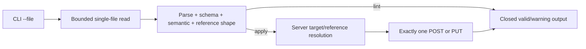

# Implemented architecture: CodeMie declarative CI/CD CLI v33.3

## 1. Status

Architecture status: IMPLEMENTED. Current executable detail is maintained in
`../../docs/implementation-reference.md`; this file retains decision rationale.

This revision implements the approved v33.3 single-file boundary. It supersedes
all earlier architecture for repository discovery, repository closure,
repository configuration, local declaration ordering, symlink-following
options, and mandatory cooperative cancellation APIs. Explicit Skill
`contentFrom` and File Datasource paths remain bounded auxiliary inputs.

## 2. Executive summary

`lint` and `apply` accept exactly one declaration through `--file`. A bounded
ordinary file read, strict parse/schema/semantic validation, and local
reference-shape validation occur under the invocation timeout. Neither command
enumerates neighboring paths or attempts to prove local reference existence.
`apply` resolves natural references online through the existing kind-specific
server adapters before any write. `login` and target configuration use only
flags and environment variables. The server reconciliation, authorization,
compatibility, confidentiality, and always-write decisions remain unchanged.

The implemented CLI now uses the bounded single-declaration loader, exposes no
repository-root or symlink-following flags, loads no repository configuration,
and performs no repository walk or graph closure. Explicit Skill `contentFrom`
and File Datasource paths are the only auxiliary reads.

## 3. Sources consulted

- Approved product specification: `../codemie-cicd-tool.md` v33.
- Declaration, CLI, HTTP, output, and adapter contracts in `contracts/`.
- Existing ADRs 001–018; ADR-019 records the v33 local-processing decision.
- Current implementation: `src/cli`, `src/config`, `src/discovery`,
  `src/repository.rs`, `src/parse`, `src/validate`, `src/lint.rs`,
  `src/coordinator`, `src/cancellation.rs`, and the entity adapters.
- Reference-only CodeMie source at the pinned 2.42.0 commit, used only for
  server-contract evidence. It is not part of this product architecture.

No Jira or Confluence content was available.

## 4. Scope and constraints

In scope: one marked YAML declaration per invocation; bounded local read;
strict closed validation; exact server-side reference and target resolution;
one create or update for valid `apply`; safe typed output; three login modes.

Out of scope: repository roots, walking, declaration discovery, local graph
closure, file ordering, configuration files, implicit/unenumerated inputs,
`--repo-root`, `--follow-symlinks`, batch operation, and a product-level
`CancellationToken` contract.

The invocation deadline and local input-size/depth/alias budgets remain. A
timeout may be enforced around the command future and bounded blocking reads;
no particular cancellation primitive is mandated.

## 5. Superseded pre-migration architecture

- Before v33 implementation, `cli` resolved a Git/repository root and repository config before
  dispatching lint/apply/save.
- The removed `repository` layer composed `discovery`, bounded YAML/sidecar reads, parse,
  effective-project materialization, natural validation, and graph validation
  over `DiskRepositoryView`/`OverlayRepositoryView`.
- `lint` and `coordinator` consumed that repository-oriented loader.
- `parse` accepted Skill `contentFrom`; `discovery` owned walking and symlink
  policy; `cancellation` is threaded through local loops.
- Adapters already owned server target/reference resolution, authorization,
  compatibility evidence, and create/update projection.

This section records migration context only. Current modules are listed in
`../../ARCHITECTURE.md` and `../../docs/implementation-reference.md`.

## 6. Requirements and quality attributes

| Requirement | Architecture response |
|---|---|
| FR-001/002/004/005, v33 | `SingleDeclarationLoader` opens only `--file`, enforces the YAML budget, parses, validates, and returns one typed declaration. |
| FR-006/DR-006 | `lint` checks reference structure only; `apply` resolves every reference against the server. |
| FR-008/009/022 | Existing kind adapters retain exact identity, permission, preservation, and always-write behavior. |
| FR-011/014/016 | Closed success/warning/diagnostic renderers remain the sole output boundary. |
| v33 timeout decision | Command-level deadline plus bounded reads; no mandatory token parameter in domain APIs. |
| Security | No implicit file reads, no raw content/path diagnostics, environment-only secrets, validated endpoints. |

No new performance or availability threshold is introduced.

### Explicit auxiliary-input contract

Specification v33.3 retains Skill `contentFrom` and File Datasource
`spec.files` paths as the only auxiliary reads. They resolve from the selected
declaration parent; absolute/escaping/symlinked/non-regular/unreadable and
duplicate File targets fail. Skill reads are at most 131,072 bytes and must
yield 100–30,000 UTF-8 characters. File reads are at most 32 MiB each and
128 MiB aggregate across 1–10 paths. No directory is enumerated and no
temporary/staging copy is created.

## 7. Decisions and alternatives

### Local input

1. Retain repository view and constrain enumeration to one path: rejected
   because it preserves misleading root, sidecar, and closure abstractions.
2. Add a dedicated one-file loader while leaving the repository engine dormant:
   viable for migration, but dead production paths must be removed afterward.
3. Replace the production repository engine with a one-file loader: selected.

### Reference validation

1. Require local declarations: rejected by v33.
2. Shape-check offline and resolve online during apply: selected.

### Timeout

1. Thread a cancellation token through every domain function: allowed as an
   internal technique but not required and not part of public contracts.
2. Bound input and wrap command execution in a deadline: selected baseline.

## 8. Target components

| Component | State | Responsibility |
|---|---|---|
| CLI boundary | Modified | Exact flags; rejects removed repository/symlink options. |
| Config resolver | Modified | Flags/environment only; no filesystem config lookup. |
| Selected-input loader | New/replacement | One bounded declaration read plus only explicitly authored bounded Skill/File inputs; marked parse/schema/semantic validation. |
| Reference-shape validator | Modified | Validates only local structure and workflow-local IDs. |
| Apply coordinator | Modified | Uses one declaration and delegates online references/target resolution to adapters. |
| Entity adapters/HTTP | Retained | Compatibility, authorization, exact reads, reference resolution, and one write. |
| Render/output | Retained | Closed success, warning, and diagnostic records. |
| Discovery/repository closure | Removed from production | No runtime consumer. |

The loader owns no repository root, symbol table, or ordering. A narrow
explicit-input boundary resolves only declaration-relative authored paths and
forbids symlinks, escape, enumeration, and temporary copies.

## 9. Data and consistency

`InputFile -> BoundedBytes -> MarkedDocument -> ValidatedDeclaration ->
EffectiveDeclaration`. Effective project is declaration `metadata.project`;
where a command permits an explicit project selector, that selector is handled
by that command contract. There is no repository default.

Natural references remain typed values `(kind, project, natural key)`.
Offline validation proves their shape only. During apply, resolved server IDs
are invocation-local derived data and are never persisted. Local validation and
one remote write are separate consistency boundaries.

## 10. Security and operations

- Open only the selected path; do not enumerate its parent.
- Reject non-regular/oversized/invalid input using safe diagnostics that do not
  echo path or content.
- Preserve the 300-second invocation deadline, 60-second request deadline,
  response/pagination budgets, redirect policy, and no mutation retry rule.
- Emit structured internal fields from typed values only; never log bodies,
  declarations, credentials, raw URLs, or arbitrary errors.
- A timeout or local read failure leaves the server unchanged.

## 11. Deployment and migration

1. Update contracts/schema and add negative CLI snapshots for removed flags.
2. Introduce/test one-file loading and shape-only offline validation.
3. Switch lint/apply to the new boundary and online reference resolution.
4. Narrow Skill/File reads to explicit declaration-relative paths, remove
   repository-root dependence, and retain bounded multipart streaming.
5. Remove repository config/walking/closure production paths and
   dependencies that become unused.
6. Refresh examples/runbooks and run pre/post implementation verification.

Rollback is source rollback before release. Mixed contract versions are not
supported within one binary; the CLI artifact and embedded schema move together.

## 12. Diagram

## 13. ADRs

- ADR-019: Accepted — single-file local-processing boundary.
- ADR-001: revised — embedded schema remains; explicit auxiliary paths are
  narrow inputs rather than repository discovery.
- ADR-010: revised — warnings follow validation of the selected declaration.
- ADR-011: revised — endpoint sources are flags/environment only.
- ADR-007/008/014–018: retained for server reconciliation behavior.

## 14. Implementation stages and handoff

The bounded tasks are in `tasks.md`. Pre-implementation verification must prove
that the CLI, declaration schema, adapter expectations, and save v3 contracts
agree on inline Skill content and single-file validation. The implementation
owner must update user-facing README/examples/runbooks after code convergence.

There are no unresolved architecture decisions blocking implementation.
