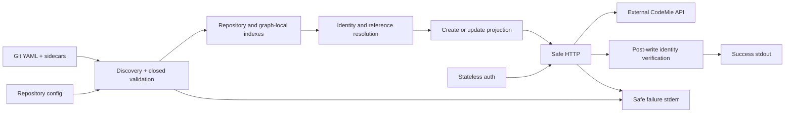

# Architecture plan: CodeMie declarative CI/CD CLI

## 1. Status

**Architecture status: READY FOR PRE-IMPLEMENTATION VERIFICATION**

Product specification v29 is the approved source. The architecture now pins
presence, null, applicability, ownership, and transport classes for every
admitted field, requires an explicit token endpoint with deterministic
precedence, incorporates all architect-owned security remediation from the
pre-implementation security review, and synchronizes the v27 per-file lint
warning lifecycle (`security-review-preimplementation.md`):

- **ADR-003 handoff**: ADR-003 superseded by ADR-011 (credential input,
  ValidatedUrl, TLS, redirect policy).
- **SEC-001** (CLOSED by product-spec-owner, v25): secret credentials
  env-only, corresponding flags `E_USAGE` exit 2.
- **SEC-002** (CLOSED): ValidatedUrl type, HTTPS/loopback policy, redirect
  disable for auth POSTs, URL userinfo rejection in all schemas.
- **SEC-003** (CLOSED): versioned resource budget defaults for all 18 resource
  dimensions in `http-adapter.md` §2.4 and `data-model.md` §11.
- **SEC-004** (CLOSED AND VERIFIED): ADR-012 Option A applies to Workflow,
  Skill, and Datasource; the implementation strictly binds project-admin
  evidence to the exact effective project and the final Q-007 security review
  approves the correction.
- **SEC-005** (CLOSED): identifier maxLength and control/bidi pattern in all
  schemas; output rendering rules in `cli.md` §10.
- **SEC-006** (CLOSED): supply-chain and CI controls amendment in ADR-005.

The v28 compatibility and zero-based Workflow/Skill pagination corrections are
implemented and independently verified. Q-007's final security review is
`APPROVED FOR NEXT STAGE`, and the final post-implementation convergence report
is `PASS`; Q-008's page-0 decision is implemented and covered by that final
verification. This closes the earlier T-003/W-001/S-001/R-001 correction gate
without completing live deployment qualification.

O-001's checked-in serialization, exact-artifact, inventory, and recovery
controls are independently verified and security-approved, but O-001 remains
operationally incomplete. Remote protected-environment activation, runner and
mutex evidence, live inventory, external-writer freeze, and first-apply
checksum evidence have not been supplied. Local O-002 examples and runbooks and
the local V-000 qualification harness may proceed without claiming that remote
activation. Provider adoption and target-specific qualification remain
separate, externally evidenced stages.

## 2. Executive summary

The implementation baseline is one self-contained Linux x86_64 Rust executable,
`codemie-gitops`, with
offline `lint`, single-entity `apply`, and stateless `login`. Checked-in closed
schemas define the authoring surface for exactly four entities: Assistant,
Workflow, Datasource, and Skill. Direct REST adapters resolve an exact identity,
project the declaration into the pinned operation request, issue POST when the
identity is absent or PUT when it is present, and verify identity after the
write. Every valid apply writes once and reports only `created` or `updated`.

Workflow uses its reserved `meta_config` identity and explicit by-UUID legacy
adoption. Skill and Datasource use exhaustive, ambiguity-refusing list
resolution because their server persistence does not enforce the approved
natural key. Datasource kinds are peer request projections within one adapter;
file/source/content fields use ordinary write-through CRUD. There is no delete,
local state, generic marker, interpolation, or dedicated Datasource lifecycle
surface.

## 3. Sources consulted

- Approved product source: `specs/codemie-cicd-tool.md` v29, all sections,
  especially SC-021, IR-011/012, AC-IR-011-01, and AC-IR-012-01.
- Security review input: `security-review-preimplementation.md` (read-only;
  findings SEC-001–SEC-006 used as remediation drivers).
- Verification sources: `Q-006-verification-report.md` (read-only v26 baseline)
  plus `Q-007-post-implementation-verification.md`,
  `Q-007-security-review.md`, and `Q-008-verification-report.md`.
- Operational-control evidence: `O-001-verification-report.md`,
  `O-001-security-review.md`, `.github/workflows/ci.yml`,
  `.github/workflows/codemie-gitops-apply.yml`, `.gitlab-ci.yml`, and
  `ops/o001/CHECKLIST.md`.
- Backend reference: tag `2.42.0`, commit
  `2a481c290c99bf30ef80aadafa03d876a7f5f732`.
- UI reference: tag `2.42.0`, commit
  `55945d075d82e771c4a2f4238afec1eb4c79d1e1`.
- Exact evidence and paths: `research.md`, `contracts/source-baseline.md`, and
  `contracts/adapter-manifest-v2.42.0.json`.
- User-supplied deployment context: an ignored, untracked, owner-only `.env`
  contains local credentials and `CODEMIE_TEST_PROJECT` for
  `https://codemie.lab.epam.com/`. Values were not read into architecture
  artifacts and the project remains opaque. The target URL, project, and
  credentials are test inputs, not proof of O-001 activation or authorization
  to modify arbitrary entities.
- Jira/Confluence: none available.

The two source trees are reference-only evidence, never implementation targets
or runtime dependencies.

## 4. Scope and constraints

In scope: marked YAML, deterministic repository discovery, effective project
configuration, closed schema/semantic/cross-reference validation, Skill
sidecars, exact REST reconciliation, ordinary per-kind Datasource CRUD,
Keycloak/local-development login, safe human/JSONL output, and GitHub/GitLab
operational patterns.

Out of scope: plan/batch/delete, overlays/templates/interpolation, local state,
generic ownership/adoption, credential or external-integration provisioning,
live provider-schema discovery, dedicated Datasource lifecycle controls, server
changes, and changes to either reference repository.

Quality constraints include one static binary, no reference Python dependency,
offline lint, fail-closed identity, serialized production apply, strict
allowlist output, and deployment contract testing.

## 5. Current architecture

The implementation baseline exists in the product area under `src/`, with the
binary entry point and command dispatch, offline repository loading/lint,
single-entity apply coordination, per-kind adapters, authentication/HTTP
boundaries, and typed output rendering. `tests/cli_lint.rs` supplies CLI lint
integration coverage. D-001's Datasource adapter baseline is implemented in
`src/adapters/datasource.rs`. External CodeMie remains the remote system of
record and exposes the Assistant, Workflow, Skill, and ordinary per-kind
Datasource contracts consumed by the CLI; it owns remote records,
authorization, and external integrations.

Important limits are: Workflow identity metadata has no database uniqueness
constraint; Skill uniqueness includes creator; Datasource natural uniqueness is
not database-enforced and `find_id` returns a first match; writes lack a common
conditional-update contract; `/v1/info` does not reliably identify source
compatibility. Exact exhaustive reads, privilege proof, serialized writers,
post-write identity verification, manual ambiguity remediation, and pinned
deployment tests contain these limits.

The corrected implementation no longer contacts `/v1/info` as a compatibility
gate. It derives operation-applicable evidence from strict direct lookup for
Assistant and from exact-effective-project capability plus strict identity,
reference, detail, ability, and zero-based pagination reads for Workflow,
Skill, and Datasource. A modifying transport call is reachable only through a
sealed prepared write created after those reads and request projection.

Workflow and Skill scanners now request page 0 first and reuse the same scanner
for initial, post-write, adoption, and Skill create-409 paths. The final Q-007
post-implementation report permanently supersedes its earlier one-indexed
statement and verifies the implemented page-0 behavior. The remaining
limitations are operational: no local test proves a particular remote target's
contract, CI-provider protection, runner isolation, writer freeze, or mutex
behavior.

## 6. Requirements-to-architecture map

| Requirements | Architecture response |
|---|---|
| FR-001–004, FR-022/023/025/027, VR-016 | closed bundled schema; effective project; source-pinned required/optional-null classes; scalar YAML-relative sidecars; deterministic offline index |
| FR-005/006/008/012/015/021, DR-012 | resolve identity; POST if absent; PUT if present; optional omission/null to explicit null; bounded applicability/ownership transforms; no delete |
| FR-009/011/014/016/024/026 | stateless auth; exact exit union; stdout success/stderr failure; repository-closure validation before target-only lint warnings; bytewise warning-code/canonical-field-path ordering; no warnings on failure; allowlist renderer |
| FR-017 | exact per-field precedence; closed non-secret repository config; secret credentials from environment only; non-secret selectors from flag or environment (SEC-001, v25) |
| FR-019/020 | no generic adoption or ownership marker; Workflow-only identity exception |
| FR-028–030, FR-032–035 | Workflow reserved record, exhaustive resolver, explicit adoption, exact local actor/reference projection, race visibility |
| FR-031–034 | exhaustive Skill resolver, privileged visibility/write proof, bounded 409 recovery, no tie-break/delete |
| FR-036, IR-008 | one Datasource adapter, peer exact create/update mappings, ordinary write-through CRUD, no dedicated lifecycle surface |
| IR-011/012, SC-021 | pinned source-derived contract; `/v1/info.version` is observability only; Workflow/Skill/Datasource require exact-effective-project visibility while Assistant uses strict direct lookup; all operation-applicable evidence is sealed with the prepared write before POST/PUT |
| FR-029/031/034, IR-012 | Workflow and Skill enumeration starts at page 0; initial, post-write, and Skill create-409 scans validate zero-based page echo/count invariants before write or success |
| PA-005/006, QR-009–011 | privileged resolver identity, serialized CI, writer governance, inventory/remediation |
| IR-006, QR-012 | provider-safe CI token delivery: GitHub fresh login plus immediate native add-mask in one protected step; GitLab pre-supplied environment-scoped protected+masked token with no login; no persistence, transfer, re-emission, or simulated fallback |
| SEC-001 (v25) | env-only secret credentials; `--token`/`--client-secret`/`--password` flags are E_USAGE, exit 2, before network access; ADR-011 |
| SEC-002 (v25) | ValidatedUrl type; HTTPS-required auth_url; loopback exception for target_url; userinfo/fragment/control-char rejection in all URL schema patterns; redirect disabled for auth POSTs; ADR-011 |
| SEC-003 (v25) | 18 versioned resource budget defaults; YAML, file, network, response, pagination, concurrency, deadline dimensions; `http-adapter.md` §2.4; `data-model.md` §11 |
| SEC-004 (v28 correction) | ADR-012 Option A; global admin/maintainer or exact-effective-project admin predicate for Workflow/Skill/Datasource; Assistant excluded under PA-003; missing fields incompatible; false predicate visibility-unproven |
| SEC-005 (v25) | identifier maxLength and control/bidi pattern rejection in all schemas; safe output rendering rules (one line/record, JSON serializer, canonical field paths, multipart basename safety); `cli.md` §10 |
| SEC-006 (v25) | Cargo.lock committed; --locked builds; RustSec scanning; SHA-pinned CI actions; permissions blocks; secret isolation for fork/PR; protected deployment environments; same-artifact promotion; SBOM; ADR-005 amendment |

## 7. Decisions and alternatives

### Author/schema contract

- Selected: closed checked-in v1alpha1 schema plus a source-pinned adapter
  manifest. This gives offline determinism and prevents target drift from
  widening authoring.
- Rejected: live OpenAPI as the author schema, because source fields/defaults
  and the exposed version are not a stable product contract.
- Rejected: permissive YAML forwarded to the server, because it violates local
  unknown, secret, and runtime-field rejection.

### Reconciliation identity

- Assistant: direct exact slug/project API.
- Workflow: reserved `meta_config` record with explicit by-ID legacy adoption;
  display name is never an implicit selector.
- Skill: exhaustive exact list resolution because transport IDs cannot adopt
  existing rows and server uniqueness is creator-scoped.
- Datasource: exhaustive exact list resolution because `find_id` is first-match
  and database natural uniqueness is absent.

Server-side natural-key endpoints would improve atomicity but are outside the
approved scope. Client state, UUIDs in declarations, and implicit display-name
selection conflict with the approved portability and identity boundaries.

### Write policy

- Selected: operation-driven write-through. Resolution produces either
  `Create(request)` or `Update(server_id, request)`. Existing entities receive
  PUT on every valid invocation.
- Rejected: field-state-dependent write suppression, because v24 explicitly
  defines repeat apply as update.

### Presence and null policy

- Selected: classify every field from the pinned request contracts. Omission
  and YAML null produce an explicit null for optional-null JSON properties on
  create and update. Null-rejecting/defaulted fields remain authoring-required.
- Selected: do not fabricate properties for authoring-only,
  operation-inapplicable, read-only, or mixed/tool-owned structures. Workflow
  `meta_config` retains its preservation merge.
- Rejected: retain omission or materialize a concrete server default; both
  violate v24. Target-existence-dependent validation is also rejected because
  a field rejected as null in either operation must be required before
  resolution.

### Packaging

- Selected: modular library plus one Rust binary, minimizing distribution and
  OS dependencies while retaining testable boundaries.
- Rejected: Python/server-package reuse and multi-service deployment because the
  product requires a self-contained Rust CLI.

### Authentication endpoint

- Selected: Keycloak receives one exact endpoint resolved as `--auth-url` >
  `CODEMIE_AUTH_URL` > repository config `auth_url`. The highest-precedence
  value is validated and used as-is.
- Rejected: deriving or probing an identity-provider URL from the CodeMie API
  URL, hostname, realm, path, or other convention. No such contract exists and
  v24 prohibits it.
- Missing explicit endpoint is a local exit-2 failure before any network call.
  Secret credentials (`CODEMIE_TOKEN`, `CODEMIE_CLIENT_SECRET`, `CODEMIE_PASSWORD`)
  are accepted from environment only; the `--token`, `--client-secret`, and
  `--password` flags are not accepted. Non-secret selectors (`--client-id`,
  `--email`) use flag-over-environment precedence. No credential is loaded from
  repository config. (SEC-001 remediation, v25.)
- Mode (c) Keycloak ROPC (v26): uses the same `auth_url` as Mode (a) but sends
  `grant_type=password` with `client_id` (defaulting to `codemie-sdk` if unset),
  `username` (`CODEMIE_EMAIL`), and `password` (`CODEMIE_PASSWORD`). No
  `client_secret` is used or sent. Selected when `CODEMIE_CLIENT_SECRET` is
  unset, `CODEMIE_EMAIL` + `CODEMIE_PASSWORD` are set, and `auth_url` is
  configured. Same HTTPS, redirect-disabled, and SEC-001 env-only rules apply as
  for Mode (a).

## 8. Target components

| Component | Responsibility | Security/failure boundary |
|---|---|---|
| command shell | exact commands, flags, config, and exits | rejects usage before network |
| discovery/loader | deterministic YAML and sidecar reads | bounds, containment, source coordinates only |
| schema/semantic validator | closed v1alpha1, effective project, and field-presence classes | no live schema/default insertion |
| repository index | offline natural and graph-local reference closure | no server access |
| lint warning evaluator | after complete repository-closure validation, evaluate only the `--file` declaration and sort by fixed warning code then canonical field path | never emits on a failed lint or for closure-only declarations |
| request projector | typed create/update requests from authored intent | only approved transforms; no equality branch |
| resolver/adapters | four entity protocols and peer Datasource mappings | exact identity, visibility, and write proof |
| auth/transport | bearer/login, TLS/proxy/CA, retries/timeouts/strict decode | secrets isolated; bodies discarded |
| output boundary | typed stdout outcome, typed stderr warning, and typed stderr diagnostic | warnings only on successful lint; failure is exactly one diagnostic; no generic message/body API |



## 9. Data and consistency

Git is the desired-state source; CodeMie owns remote records. The CLI stores no
state. `metadata.project` may be omitted when repository config provides a
non-empty default. Skill `contentFrom` is a scalar path relative to its
declaring YAML. Natural keys contain effective project plus the kind key and
never server IDs.

Request projection includes authored fields plus only FR-021 transformations.
It never inserts server defaults. Required/null-rejecting values must be
authored. An omitted or explicit-null optional authorable property becomes a
present JSON null in each applicable JSON request. Authoring-only,
operation-inapplicable, read-only, and mixed/tool-owned members receive no
fabricated null. Operation-specific contracts decide which fields exist on
create and update; create-only fields are absent from update. Existing server
reads are used only where needed for identity,
authorization, Workflow metadata preservation/adoption, server-shape decoding,
reference mapping, or post-write identity verification.

One POST or PUT is the modifying transaction boundary. There is no blind write
retry, delete, or rollback. The one Skill create-409 path performs one bounded
full resolution and never repeats POST. An uncertain result reports a safe
failure and requires re-resolution on a later invocation.

## 10. API and Datasource mapping

The checked-in adapter manifest is authoritative for exact routes, operation
fields, pagination, response fields consumed by resolution, and representation
transforms. `/v1/info.version` is not source/API identity, is not required
operation evidence, is never compared with the manifest Git SHA, and cannot
accept or reject `apply`. The pre-write gate instead consists of every
non-mutating response needed by the selected operation: capability/visibility,
identity and reference resolution, detail/preservation reads, and exhaustive
pagination where applicable. Each consumed field and shape is strictly decoded;
missing or invalid evidence is `E_API_INCOMPATIBLE`, exit 2, before POST/PUT.
Additional unconsumed fields are ignored and cannot widen declarations or
requests. Live OpenAPI and `/v1/info` cannot expand the contract.

Workflow and Skill list pagination is zero-indexed, matching Datasource. Each
scan requests page 0 first and then `1..pages-1`; an empty scan still requests
page 0 once. Page 1 is never the origin. The same scanner is reused for initial
resolution, post-write verification, and Skill create-409 re-resolution.

For Workflow, Skill, and Datasource, capability evidence is global
admin/maintainer or an exact match on both
`projects[].name == effective_project` and
`projects[].is_project_admin == true`, from the same entry. Assistant uses its
strict direct `(project, slug)` lookup without `/v1/user`. After all applicable
reads and request projection, the coordinator seals the kind-specific evidence
with the prepared write. The modifying HTTP boundary accepts only that sealed
type, making the no-write-before-evidence ordering enforceable rather than
conventional.

Datasource uses one exhaustive resolver and peer per-kind create/update
projections. File, source, content, scheduling, and configuration fields in the
selected ordinary operation contract are transmitted on each valid apply.
File uses the singular multipart route, byte-preserving UploadFile parts, and
the pinned JSON-string/query encodings. Workflow `meta_config` is decoded from
and encoded to its source-pinned string form.
External integration references are opaque pre-existing values; CodeMie is
authoritative for validation and authorization. The CLI exposes no dedicated
Datasource lifecycle command, flag, or endpoint.

## 11. Security and output

Use one least-privilege invocation principal. Workflow and Skill writes require
complete project visibility plus write proof. Credentials come only from the
approved environment or flags and never repository config/YAML. HTTPS is
required outside explicit local development; proxy/CA support, disabled
cross-origin credential redirects, bounded retries/body drains, and typed
response decoding protect the network boundary.

**URL and TLS policy (SEC-002, ADR-011)**: Every URL input is a `ValidatedUrl`
(absolute http/https, no userinfo, no fragment, no C0/C1 controls). `auth_url`
requires HTTPS unconditionally; `target_url` requires HTTPS except for resolved
loopback addresses (127.0.0.0/8 or ::1). URL userinfo is rejected at schema
validation time. An invalid higher-precedence URL is `E_CONFIGURATION`, exit 2;
lower-precedence values are not consulted. Redirects are disabled for Keycloak
`POST .../token` and local-auth `POST /v1/local-auth/login`; a 3xx response is
`E_AUTHENTICATION`, exit 2. For API calls, redirects are preferred-disabled; if
retained, must be method-aware, same-origin (same scheme+host+port), max 3
hops, with no Authorization header forwarded to a different authority.

**Resource budgets (SEC-003)**: Versioned defaults for 18 resource dimensions
are defined in `contracts/http-adapter.md` §2.4 and `data-model.md` §11,
including YAML parsing limits (1 MiB/file, depth 32, alias 1,000, scalar 128
KiB), file/sidecar (32 MiB per file, 128 MiB aggregate), response body (8 MiB),
pagination (1,000 pages / 100,000 items), retries (3 GET), timeouts (60s
request, 300s invocation deadline), and concurrency (1 sequential request). The
YAML-per-file and aggregate-upload limits are flagged for product-spec-owner
confirmation if any currently-deployed declaration exceeds them.

**Identifier constraints (SEC-005)**: Identity-bearing fields in output and
schemas (`project`, `slug`, `name`, `repo_name`, `fieldPath`) have maxLength
bounds and reject C0/C1 control characters (U+0000–U+001F, U+007F–U+009F) and
bidi formatting characters (U+202A–U+202E, U+2066–U+2069). Output rendering
rules are in `cli.md` §10: one physical record per line, JSON via serializer
(not concatenation), field paths generated canonically from YAML AST,
percent-encoded route/query parameters, multipart basename safety checks.

**Supply-chain controls (SEC-006)**: Cargo.lock is committed; all builds use
`--locked`; RustSec advisory scanning and license review are CI gates; CI
action references are SHA-pinned; permissions blocks are set on all workflows;
secrets are isolated from fork/PR contexts; deployment environments are
protected; same-artifact promotion is required; SBOM and provenance accompany
releases. See ADR-005 amendment.

Success validates against `outcome.schema.json` and contains only action, kind,
project, and the kind natural-key member.
Apply actions are `created` or `updated`; lint uses `valid`. A successful lint
evaluates suspected-plaintext-secret and deprecated-value warnings only for the
`--file` declaration after the complete repository closure validates, then
emits them by bytewise fixed warning code and canonical field path. If any
closure declaration fails, lint emits no warnings: stdout is empty and stderr
contains exactly the closed `diagnostic.schema.json` failure record. Bodies,
server text, payloads, declaration/sidecar values, secrets, arbitrary headers,
raw URLs, and exception strings never enter output or logs.

Architecture-remediation security review items are closed (see §1 status).
Post-implementation security review (V-002) remains a downstream lifecycle
task.

## 12. Operations, deployment, and recovery

Build once and promote the same static Linux x86_64 artifact. Configuration and
secrets are environment-specific inputs. Pre-implementation verification must
approve spec/schema/manifest/task convergence. Deployment verification runs
non-mutating contract and behavior fixtures against a target; drift blocks that
deployment or release, not architecture readiness.

Production applies serialize per target environment. Teams govern other
Workflow/Skill identity writers and maintain duplicate/marker inventory and
manual remediation. Logs and metrics use only safe action/category/status/
latency/request identifiers. Rollback is the prior binary plus Git revert and a
new apply; existing remote writes are not automatically reversed.

The checked-in O-001 provider workflows, control policy, operator checklist,
activation-evidence template, inventory tooling, local validator, and tests are
implemented and have passed independent verification and security review. They
are activation inputs, not evidence that remote provider controls are active.
The platform and release owners must still supply the external provider/runner,
mutex, live inventory, writer-freeze, and first-apply checksum records required
by `tasks.md`; until those records pass the checked-in evidence gate, O-001
remains operationally incomplete.

### Local documentation and example boundary (O-002A)

O-002 is delivered in two stages without changing its acceptance criteria.
O-002A owns locally verifiable documentation, examples, policy checks, and
tests. O-002B owns adoption of those examples in a real remote provider and
therefore remains dependent on completed O-001 activation. O-002 as a whole is
complete only when both stages pass.

The implementation layout is fixed as follows:

```text
README.md
examples/
├── README.md
├── repository/
│   ├── .codemie/config.yaml
│   ├── assistants/example-assistant.yaml
│   ├── workflows/example-workflow.yaml
│   ├── skills/example-skill.yaml
│   ├── skills/example-skill.md
│   └── datasources/example-datasource.yaml
└── ci/
    ├── github-actions.yml
    └── gitlab-ci.yml
ops/o002/
├── README.md
├── GIT_REVERT_RECOVERY.md
├── WORKFLOW_ADOPTION.md
└── UNCERTAIN_WRITE.md
scripts/check_o002_examples.py
tests/test_o002_examples.py
```

The root README is the operator entry point: build/install, offline lint,
configuration precedence, three login modes, in-memory token reuse, apply's
always-write behavior, output/exit contracts, the four examples, and recovery
links. `examples/README.md` explains the sample repository and invocation
order. Example CI files are inert samples under `examples/`; the existing
root provider definitions remain the O-001 controls.

All secret values are injected through environment variables. Examples contain
no secret-bearing flags, `.env` loading in CI, token echo/persistence, shell
tracing, HTTP/body logging, TLS bypass, or local-auth CI flow. GitHub captures
one fresh `codemie-gitops login` token inside the protected apply step,
immediately registers it with GitHub's native runtime add-mask control before
any later command or output, and reuses it only from that step's memory. GitLab
does not invoke `login`; its protected job consumes one pre-supplied,
environment-scoped protected+masked `CODEMIE_TOKEN` and retains it only in that
job's process memory. Neither provider persists, transfers, re-emits, or
simulates masking for a token. Pull-request/fork jobs remain secret-free; an
apply job uses a protected, approval-gated environment and consumes the same
checksummed binary built and tested without deployment credentials.

The checker structurally parses the sample provider files and runbooks, runs
offline lint for every declaration from the example repository, and fails on
unsafe credential flags, `--insecure`/TLS bypass, `source .env`, `set -x`,
debug/body logging, token output/persistence or transfer, unprotected apply
jobs, fork/PR-secret reachability, a protected-job rebuild, missing GitHub
native masking, any GitLab `login` invocation or simulated masking, failure to
consume GitLab's pre-supplied protected+masked token, or missing recovery
prohibitions. Its tests include positive fixtures and mutation-negative cases;
text matching alone is not sufficient evidence for provider structure.

### Target qualification and enterprise smoke boundary

V-000 is likewise split without weakening completion: V-000A prepares the
local, non-mutating target-qualification harness; V-000B executes it against a
named deployment and alone supplies target-specific completion evidence. The
local harness records only the fixed non-secret staged-binary SHA-256,
manifest version, pass/fail, safe request IDs, and the required page-0
observations. It never records response bodies, entity payloads, URLs, or
credentials. A V-000B evidence record is valid only for the staged binary
named by that digest.

The enterprise create/update smoke is a later deployment-verification task,
not O-001 activation. Its executable entity allowlist is closed to exactly
Assistant, Workflow, and Skill. A Datasource declaration, manifest member,
kind selector, or authorization exception is invalid for V-003 and fails
locally before authentication or any other network access. Any future live
Datasource exercise requires a separate task and security review; it cannot be
enabled as a V-003 option.

Before any write, the user or platform owner must confirm an authorized
non-production `CODEMIE_TEST_PROJECT`, the authorized actor, complete
visibility/write capability, the durable-record owner, and a bounded exclusive
writer window. After credential loading, V-003 reruns the complete V-000B
qualification in the same controlled execution with the same token/session
that will be used by apply; a prior or differently scoped V-000B record cannot
satisfy this runtime write gate. The harness strictly decodes
`GET /v1/user.email` as the authenticated actor identifier together with the
required role/project fields and proves this exact equality chain:

```text
authorization.project
  == CODEMIE_TEST_PROJECT
  == every declaration's resolved effective project
  == the exact projects[].name entry used by the fresh V-000B role proof
```

The authenticated actor must equal `authorization.actor`. That exact project
entry must exist, and the role predicate must be global administrator,
global maintainer, or `is_project_admin=true` on that same entry; an admin role
for another accessible project is insufficient. The authorization record must
also carry an explicit `exclusiveWriter.confirmed=true`, confirmer, start/end
times, and the run-scoped identity prefix. The current time and the complete
create/update sequence must fall inside that window, and the confirmer must
attest that no other writer can use the prefix during it. Missing, false,
expired, future, differently scoped, or non-covering confirmation fails before
the first write.

The harness first runs offline lint and login, then the fresh non-mutating
V-000B probes and the equality/window gates, and stops on any failure. Each
entity uses a reviewed run-scoped natural key that is proved absent before the
first apply. The smoke performs one serialized create followed by one
serialized repeat apply, which must report `updated` under FR-006. It never
blindly retries, deletes, rolls back, or automates cleanup. Any uncertain write
holds further activity and routes to complete inventory and manual remediation.

The local credential file is parsed by a strict non-evaluating loader; it is
never sourced or otherwise executed as shell. Only documented `CODEMIE_*` keys
and `CODEMIE_TEST_PROJECT` are accepted, and duplicate, unknown, malformed, or
multiline records fail before network access. Before loading, the harness
requires a regular non-symlink file, owner-only permissions, and ignored plus
untracked Git status. It binds values only in memory and verifies internally
that the resolved target equals the separately authorized HTTPS origin without
printing either value. CI examples never consume `.env`.

V-000A does not implement an authentication client. It verifies the staged
binary SHA-256 and obtains a token only by invoking that exact
`codemie-gitops login` binary, or consumes an already supplied `CODEMIE_TOKEN`;
the same unchanged staged binary is retained for V-003. V-000B persists that
digest in its sanitized record. V-003 must bind its evidence to the same digest
and reverify it immediately before every apply; mismatch fails before
authentication when first detected and before the next write if the staged
binary changes during the controlled execution. The probe's separate read-only
transport remains bound to ADR-011 and the HTTP resource budgets:
verified HTTPS, no URL userinfo or proxy downgrade, redirects disabled for
every request, exact authorized origin before and after URL resolution, and no
Authorization header outside that origin. Its transport exposes only GET below
argument parsing, uses bounded connect/read and invocation deadlines, caps each
response at 8 MiB and pagination at 1,000 pages/100,000 items, strictly decodes
every consumed JSON member, and emits only fixed sanitized errors without raw
exceptions. Adversarial fake-server tests prove same-origin and cross-origin
3xx are not followed, credentials never reach a redirect target, no modifying
method exists, budgets stop reads, and secret/body canaries never appear.

V-000 target/source qualification retains the full pinned, non-mutating read
contract, including Datasource GET compatibility required by IR-008. That read
coverage does not admit a Datasource declaration or authorize a Datasource
write. V-003's smoke manifest requires exactly one Assistant, one Workflow, and
one Skill declaration and rejects every other entity member or kind before
network access. The smoke records only the staged-binary SHA-256, the CLI's
approved action, kind, project, and natural-key outcomes, plus sanitized harness
status; the ignored `.env` is never copied, printed, committed, or treated as
authorization.

## 13. Implementation stages

1. **Complete** — the pre-implementation architecture convergence and security
   review that gated baseline implementation; these do not replace V-001 or
   V-002.
2. **Complete** — binary, closed repository config, discovery, exact
   declaration schema, and offline references.
3. **Complete** — request projection plus typed success/warning/diagnostic
   boundaries, including the v27 lint-warning contract.
4. **Complete and independently verified** — T-003 removed the semantic
   `/v1/info.version`/Git-SHA gate while retaining strict operation-applicable
   pre-write evidence; Q-007 security review approved the result.
5. **Complete and independently verified** — W-001 and S-001 use page-0
   Workflow/Skill scanning for initial, post-write, adoption, and Skill 409
   re-resolution paths; Q-008 is implemented and its stale page-origin evidence
   is superseded.
6. **Complete and independently verified** — R-001 owns the sealed prepared-
   write boundary and coordinator-level success/no-write evidence.
7. **Implemented locally / operationally incomplete** — O-001 checked-in
   serialization and identity-writer governance controls are independently
   verified, security-approved, and ready for remote activation. O-001 remains
   blocked on the external provider/runner, mutex, live inventory,
   writer-freeze, and first-apply checksum evidence.
8. **Ready for local implementation** — O-002A produces the README, portable
   examples, recovery runbooks, checker, and tests. V-000A produces the local
   non-mutating qualification harness. Neither requires nor proves remote
   O-001 activation.
9. **Externally gated** — O-002B requires remote O-001 plus provider adoption;
   V-000B requires a named live target and credentials. The authorized
   enterprise create/update smoke follows V-000B and the O-002A safety guide,
   and is closed to Assistant, Workflow, and Skill. V-001 still depends on
   completed O-002 and V-000; V-002 and L-001 retain their existing downstream
   order.

Detailed bounded work and exact dependencies are in `tasks.md`.

## 14. ADRs

Statuses below mirror the status section in each ADR file.

| ADR | Status | Decision |
|---|---|---|
| 001 | Proposed | bundled closed schema and marked YAML |
| 002 | Proposed | resolve-project-write reconciliation without default insertion |
| 003 | Superseded by ADR-011 | stateless auth and safe HTTP (historical; credential input and URL/TLS/redirect policy superseded by ADR-011) |
| 004 | Proposed | source-pinned manifest compatibility gate |
| 005 | Proposed | modular single Rust binary; v25 amendment adds supply-chain and CI controls (SEC-006) |
| 006 | Superseded by ADR-008 | derived Workflow UUID rejected |
| 007 | Accepted — amended 2026-08-11 | exhaustive Skill resolver, zero-based pagination, and unconditional existing-entity PUT |
| 008 | Accepted — amended 2026-08-11 | Workflow marker, zero-based pagination, explicit adoption, and unconditional existing-entity PUT |
| 009 | Accepted — amended by ADR-012 (visibility precondition) | uniform Datasource ordinary write-through CRUD boundary |
| 010 | Proposed | separate closed success/failure records |
| 011 | Proposed | URL validation, credential input (env-only secrets), TLS/HTTPS policy, redirect policy; supersedes ADR-003 on these topics |
| 012 | Accepted — Option A selected, 2026-08-10 | project-admin complete-visibility preflight; D-001 complete |

## 15. Risks and open questions

| ID | Type | Risk/question | Treatment/owner |
|---|---|---|---|
| R-01 | non-blocking | deployment differs from pinned source | target contract suite; verification/release owner |
| R-02 | non-blocking | resolver snapshots churn or external writers race | fail closed, serialization, governed writers, remediation |
| R-03 | non-blocking | provider schema varies by deployment | reject until an exact reviewed schema is bundled |
| R-04 | non-blocking | QR-005 has no latency threshold | measure without inventing a release SLO; product owner may later define |
| R-05 | external gate | `CODEMIE_TEST_PROJECT` is configured, but target-side actor/write authorization and an exclusive window are not evidenced in repository artifacts | after a fresh same-session V-000B pass, require exact authorization/config/declaration/project-role equality plus an active explicit exclusive-writer confirmation before any smoke write; platform owner |
| R-06 | excluded scope | Datasource smoke may trigger target-internal indexing, access, cost, storage, or retention | V-003 cannot express or enable Datasource; any future exercise requires a separate authorized task and security review |
| R-07 | non-blocking | checked-in examples could drift into unsafe credential or provider patterns | structural checker, mutation-negative tests, offline lint, and independent security review |
No open entity, projection, configuration, or authentication-endpoint decision
remains. V-000 deployment verification and the broader V-002
post-implementation security review remain bounded downstream lifecycle work,
not missing architecture inputs; the O-001 local-control security approval does
not complete either task.

## 16. Handoff

The verification engineer should now assess this task-graph maintenance and
the O-002A/V-000A artifact contracts before implementation. The implementation
engineer may then create only the bounded README, examples, runbooks, checkers,
and tests defined above. Security review must confirm credential isolation,
provider trust boundaries, and live-smoke fail-closed behavior before any
enterprise write. O-001 remote activation, O-002B provider adoption, V-000B
live qualification, the closed Assistant/Workflow/Skill enterprise smoke,
V-001, V-002, and L-001 remain incomplete until their own evidence passes.
