# Data model: save server entity

Status: architecture model for approved feature specification v2.

This model extends the parent
[`data-model.md`](../codemie-cicd-tool/data-model.md). Existing declaration,
natural-key, configuration, transport, and apply types retain their meaning.

## 1. Ownership and lifetime

| Data | System of record | CLI lifetime | Retained by save |
|---|---|---|---|
| Server entity and managed IDs | CodeMie | Resolution/reverse projection only | No |
| Reviewed Workflow adoption UUID | Caller/out-of-band runbook | Selector and GET route only | No |
| Declaration AST | CLI derived value | Reverse projection through validation | Only canonical YAML bytes |
| Skill main content | CodeMie | Snapshot through publication | Exact intended Markdown sidecar |
| Skill companions | CodeMie | Snapshot through validation | Inline in declaration YAML |
| Existing repository declarations | Git workspace | Prospective validation only | Unchanged |
| Staging entries | CLI publication boundary | Publication transaction only | No |
| Outcome/diagnostic | CLI output boundary | One record | External consumer decides |

The CLI owns no database, response cache, ID map, adoption map, backup, or
provenance record.

## 2. Validated command

```text
SaveCommand = {
  selector: SaveSelector,
  project: EffectiveProject,
  repo_root: RepositoryRoot,
  yaml_path: NewRepositoryRelativePath,
  skill_sidecar_path?: NewRepositoryRelativePath,
  target_url: ValidatedUrl,
  token: EnvironmentBearerToken,
  follow_symlinks: bool,
  output_mode: text | json
}

SaveSelector =
    AssistantByNatural {slug: AssistantSlug}
  | WorkflowByNatural {slug: WorkflowSlug}
  | WorkflowByIdForLaterAdoption {
        server_id: CanonicalWorkflowUuid,
        future_slug: WorkflowSlug
    }
  | SkillByNatural {name: SkillName}
  | DatasourceByNatural {repo_name: DatasourceName}
```

Boundary DTO strings are converted immediately to these validated types. An
invalid explicit value never falls back. `CanonicalWorkflowUuid` has no
serialization implementation in product output/persistence types and is
dropped after selected detail/reference reads complete.

## 3. Read evidence

```text
VisibilityEvidence =
    NotRequiredForAssistantDirectLookup
  | CompleteProjectVisibility {
        project: EffectiveProject,
        proof: GlobalAdmin | GlobalMaintainer | ExactProjectAdmin
    }

ResolutionEvidence<K> = {
  key: K,
  selected_server_id: TransientManagedId,
  visibility: VisibilityEvidence,
  scan?: StablePaginationEvidence,
  selection_mode: Natural | WorkflowIdForLaterAdoption
}

StablePaginationEvidence = {
  passes: [PassEvidence],
  every_page_zero_based: true,
  no_repeated_ids: true,
  stable_fingerprint: true,
  accumulated_total_exact: true
}
```

`ResolutionEvidence` is adapter-private and cannot construct a write request.
Save adapters receive a read-only transport capability. The existing
`PreparedWrite`/modifying dispatcher is not a dependency.

## 4. Strict response snapshots

```text
ServerSnapshot =
    AssistantSnapshot
  | WorkflowSnapshot
  | SkillObservedStableSnapshot
  | DatasourceSnapshot

AssistantSnapshot = {
  key: AssistantKey,
  author_state: AssistantAuthorState,
  reference_ids: AssistantReferenceIds
}

WorkflowSnapshot = {
  key: WorkflowKey,
  adoption_required: bool,
  author_state: WorkflowAuthorState,
  decoded_meta: StrictJsonObject?,
  decoded_execution: ServerWorkflowExecution,
  reference_ids: WorkflowReferenceIds
}

SkillObservedStableSnapshot = {
  key: SkillKey,
  detail_fingerprint: SkillFingerprint,
  main_content: Utf8SkillContent,
  companions: SortedMap<NormalizedCompanionPath, CompanionPayload>
}

DatasourceSnapshot = {
  key: DatasourceKey,
  discriminator: DatasourceReadDiscriminator,
  author_state: DatasourceReadUnion
}
```

All response DTOs are closed at contracted object boundaries. Values of known
excluded and secret fields that are unnecessary for decisions deserialize
into non-retaining ignored sinks. Raw bodies are bounded, decoded, and dropped.

## 5. Datasource discriminator and union

```text
DatasourceReadDiscriminator =
    Code {strategy: CodeStrategy, vcs: VcsKind}
  | Confluence | Jira | Xray | AzureDevOpsWiki | AzureDevOpsWorkItem
  | SharePoint | Google | File | Provider | Bedrock

CodeStrategy = Code | Summary | ChunkSummary
VcsKind = Git | Svn

DatasourceDeclarationUnion =
    Git {index_type: "git", indexType: CodeStrategy, ...}
  | Svn {index_type: "svn", indexType: CodeStrategy, ...}
  | Confluence {...} | Jira {...} | Xray {...}
  | AzureDevOpsWiki {...} | AzureDevOpsWorkItem {...}
  | SharePoint {...} | Google {...}
```

For code rows, persisted `index_type` converts to `CodeStrategy` and persisted
`vcs_type` converts independently to `VcsKind`. Neither belongs to
`DatasourceKey`, which remains `{project, repo_name}`. Legacy `index_type=svn`,
missing `vcs_type`, unknown combinations, or using `vcs_type` for a non-code
row never construct `DatasourceReadDiscriminator` and fail compatibility.

File, provider, and Bedrock construct a recognized read discriminator only so
they can produce a typed non-exportable outcome; they do not construct a
declaration union member.

## 6. Managed-reference recovery

```text
NaturalReferenceMap = {
  assistants: Map<TransientManagedId, AssistantKey>,
  skills: Map<TransientManagedId, SkillKey>,
  datasources: Map<TransientManagedIdOrContextName, DatasourceKey>
}
```

Each insertion requires exact detail and portable natural identity evidence.
Skill and Datasource keys additionally require exhaustive ambiguity proof.
Datasource context names resolve inside the selected Assistant's exact project.
Duplicate input IDs may reuse one in-memory read result but output order follows
the original domain list; the map is dropped after projection.

Workflow-local `assistants[].id`, `states[].assistant_id`, tool IDs, and custom
node IDs never enter this map. Opaque integration/configuration IDs admitted by
the declaration schema also remain values, not managed references.

## 7. Reverse projection result

```text
ProjectedDeclaration = {
  kind: EntityKind,
  natural_key: NaturalKey,
  value: ClosedDeclarationAst,
  adoption_required: bool
}

ArtifactSet =
    SingleArtifactSet {
      yaml: CompleteArtifact
    }
  | SkillArtifactSet {
      sidecar: CompleteArtifact,
      yaml: CompleteArtifact
    }

CompleteArtifact = {
  final_path: NewRepositoryRelativePath,
  bytes: ImmutableBytes,
  digest: TransientIntegrityDigest,
  content_kind: DeclarationYaml | SkillMainMarkdown
}
```

The integrity digest is internal for staging verification and is not
persisted or rendered. YAML bytes are canonical; Skill sidecar bytes are exact
UTF-8 server content.

Projection is a pure, versioned conversion governed by the declaration schema
and save-read manifest. It cannot read files, call HTTP, or publish.

## 8. Prospective repository

```text
RepositoryView = DiskRepositoryView | OverlayRepositoryView

OverlayRepositoryView = {
  base: DiskRepositoryView,
  generated_yaml: (NewRepositoryRelativePath, ImmutableBytes),
  generated_sidecar?: (NewRepositoryRelativePath, ImmutableBytes)
}

ProspectiveValidation = {
  target: ParsedDeclaration,
  complete_graph_valid: true
}
```

The overlay cannot shadow. Sidecar expansion produces the same in-memory
`spec.content` representation as lint, while the retained artifact remains
`contentFrom` YAML plus Markdown.

## 9. Publication state and consistency boundary

```text
PublicationState =
    Prepared
  | StagedAll {staged: OwnedStagingEntries}
  | SidecarPublished {yaml_stage: Stage}
  | Committed {final_artifact_set: ArtifactSet}
  | Failed {orphan_sidecar: bool}
```

The YAML no-replace rename is the commit/linearization point. Before the first
final rename, errors remove staging entries and emit a failure. After a Skill
sidecar rename, a YAML collision or failure emits a failure and may leave the
complete orphan sidecar. Save never removes a final path. Existing and
race-created paths are never mutated.

There is no transaction spanning CodeMie and the filesystem: all server reads
precede the local-only publication transaction, and save performs no server
write.

## 10. Outcome and diagnostic types

```text
SavedOutcome = {
  action: Saved,
  kind: EntityKind,
  project: EffectiveProject,
  key: Slug | Name | RepoName,
  adoption_required: True?   // Workflow ID selection only
}

SaveFailure =
    ReconciliationFailure(exit=1)
  | LocalInputFailure(exit=2)
  | LocalOutputFailure(exit=2)
  | AuthFailure(exit=2)
  | CompatibilityFailure(exit=2)
  | ConnectivityFailure(exit=2)
  | InternalFailure(exit=2)
```

Constructors accept only safe enum/context values permitted by the v2 schemas.
No raw layer error string crosses the output boundary.

## 11. Lifecycle

```mermaid
stateDiagram-v2
    [*] --> LocalValidated
    LocalValidated --> Resolved: GET-only resolution
    Resolved --> Snapshotted: strict detail/content reads
    Snapshotted --> Projected: reverse mapping and secret checks
    Projected --> Rendered: canonical immutable bytes
    Rendered --> ProspectiveValid: shared repository validator
    ProspectiveValid --> StagedAll: secure staging
    StagedAll --> SidecarPublished: Skill only
    StagedAll --> Committed: non-Skill YAML no-replace
    SidecarPublished --> Committed: Skill YAML no-replace
    StagedAll --> Failed: cleanup on failure
    SidecarPublished --> Failed: report failure; orphan sidecar may remain
    Committed --> [*]: one saved outcome
    Failed --> [*]: one safe diagnostic
```



## 12. Invariants

1. A managed server ID is reachable only from transient read/reference types.
2. A projected declaration contains no managed server ID.
3. `ArtifactSet` is constructible only after canonical rendering.
4. Publication accepts only a prospectively validated `ArtifactSet`.
5. A failure after sidecar publication may report an orphan-sidecar state; save
  never removes a final path.
6. `adoption_required` can be true only for ID-selected unmarked Workflow.
7. Datasource discriminator fields cannot participate in natural identity.
8. The save coordinator has no type-level route to a modifying HTTP method.
