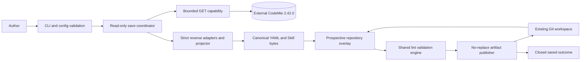
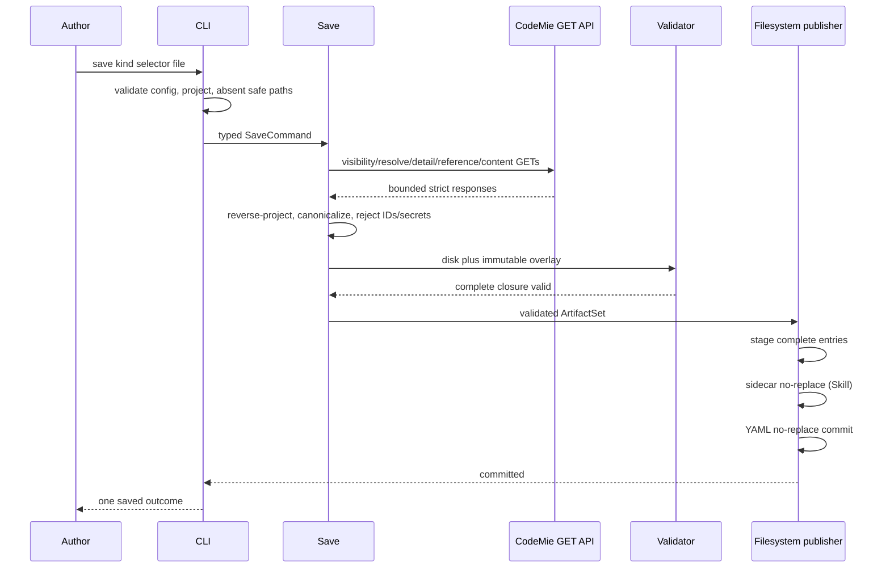

# Architecture plan: Save a server entity as a local declaration

## 1. Status

**Architecture status: READY FOR PRE-IMPLEMENTATION VERIFICATION**

The sole upstream conflict found during planning—Datasource `index_type`
conflating branch and code strategy—was routed to the product specification
owner and resolved in approved specification v2. The architecture uses the
authoritative composite mapping and carries forward no v1 discriminator rule.

Implementation remains gated on:

1. independent pre-implementation convergence verification;
2. independent security review of response allowlists, secret/mask handling,
  path traversal/staging, logs, and diagnostics; and
3. acceptance of ADR-013–017 by the authorized process.

These are lifecycle gates, not unresolved architecture decisions.

## 2. Executive summary

The current Rust CLI can discover, validate, and apply local declarations but
cannot derive a declaration from an existing CodeMie resource. The recommended
design adds a read-only `save` coordinator inside the existing single binary.
It reuses the current typed configuration/transport and entity resolution
rules, adds strict reverse-read adapters governed by a new versioned manifest,
projects one server snapshot into the existing closed declaration AST,
canonicalizes it, validates it through an in-memory repository overlay, and
publishes immutable bytes with native no-replace filesystem primitives.

The design deliberately separates three consistency boundaries:

- remote reads: source-pinned, observed-stable snapshots under one deadline;
- prospective repository validation: one shared offline engine, no writes; and
- local publication: same-directory staging plus YAML-last no-replace commit.

No server transaction is needed because `save` sends only GET. Skill detail and
companion payloads lack a revision/ETag, so an A/B/C observed-stability protocol
detects ordinary concurrent changes but cannot prove serializable isolation
against ABA changes. Filesystems lack portable multi-file transactions, so
Skill YAML is the declaration commit marker: its complete sidecar is published
first. A failure before YAML publication may leave that complete sidecar as an
orphan; save never removes or replaces final paths.

The main trade-offs are additional strict response DTO maintenance, twice-read
Skill companions, and small platform-specific publication adapters. These costs
are justified by the approved no-secret, no-managed-ID, no-overwrite, and
complete-file requirements.

## 3. Sources consulted

### Product specification

- [`spec.md`](spec.md), **APPROVED v2**, FR-SAVE-001–030,
  DR-SAVE-001–009, IR-SAVE-001–006, QR-SAVE-001–009,
  VR-SAVE-001–013, AC-SAVE-001–026.
- [`../codemie-cicd-tool.md`](../codemie-cicd-tool.md), v29 parent product
  specification.

### Jira

No Jira contents were provided or available locally.

### Confluence

No Confluence contents were provided or available locally.

### Existing architecture and contracts

- [`../codemie-cicd-tool/plan.md`](../codemie-cicd-tool/plan.md)
- [`../codemie-cicd-tool/data-model.md`](../codemie-cicd-tool/data-model.md)
- [`../codemie-cicd-tool/tasks.md`](../codemie-cicd-tool/tasks.md)
- [`../codemie-cicd-tool/contracts/cli.md`](../codemie-cicd-tool/contracts/cli.md)
- [`../codemie-cicd-tool/contracts/declaration-v1alpha1.schema.json`](../codemie-cicd-tool/contracts/declaration-v1alpha1.schema.json)
- [`../codemie-cicd-tool/contracts/adapter-manifest-v2.42.0.json`](../codemie-cicd-tool/contracts/adapter-manifest-v2.42.0.json)
- [`../codemie-cicd-tool/contracts/http-adapter.md`](../codemie-cicd-tool/contracts/http-adapter.md)
- [`../codemie-cicd-tool/contracts/outcome.schema.json`](../codemie-cicd-tool/contracts/outcome.schema.json)
- [`../codemie-cicd-tool/contracts/diagnostic.schema.json`](../codemie-cicd-tool/contracts/diagnostic.schema.json)
- Parent ADR-001, ADR-003/011, ADR-004, ADR-005, ADR-007, ADR-008,
  ADR-009, ADR-010, and ADR-012.

### Implemented product boundaries

- `src/cli/mod.rs`, `config/mod.rs`, and `main.rs`
- `src/http/mod.rs` and `cancellation.rs`
- `src/repository.rs`, `discovery/mod.rs`, `parse/mod.rs`, `schema/mod.rs`,
  `validate/mod.rs`, and `lint.rs`
- `src/adapters/{assistant,workflow,skill,datasource}.rs` and
  `src/adapters/mod.rs`
- `src/projection/mod.rs`, `coordinator/mod.rs`, `output/mod.rs`,
  `render/mod.rs`, and `error.rs`
- `tests/cli_lint.rs`

### External/reference-only source evidence

The local `codemie/` checkout was verified at tag `2.42.0`, commit
`2a481c290c99bf30ef80aadafa03d876a7f5f732`. It was inspected only as external
evidence and was not modified. Relevant source paths are enumerated in
[`save-read-reverse-v2.42.0-v1.json`](contracts/save-read-reverse-v2.42.0-v1.json).

Notable verified facts:

- Assistant exact slug detail is `GET /v1/assistants/slug/{slug}?project=...`;
  the response masks sensitive prompt-variable defaults and enriches
  sub-Assistants, Skills, categories, and guardrail assignments.
- Workflow enumeration is zero-based, has project and marketplace passes, and
  detail is `GET /v1/workflows/id/{id}` with string-encoded `yaml_config` and
  `meta_config`.
- Skill list is zero-based; detail contains main content and companion metadata;
  payload is `GET /v1/skills/{id}/companion-files/content?path=...`.
- Datasource exhaustive list is `GET /v1/index?full_response=true...`; detail
  is `GET /v1/index/{id}` and includes scheduler enrichment. Settings and
  status-Markdown routes are not authoring reads.
- Code Datasource `IndexInfo.index_type` stores code strategy while
  `IndexInfo.vcs_type` stores Git/SVN branch. Non-code persisted values use the
  closed mapping in specification DR-SAVE-008.

## 4. Problem and scope

### Technical problem

Deriving portable desired state from a live resource is not the inverse of the
current write projector. Server reads contain managed IDs, runtime and audit
fields, aliases, masked/secret fields, mixed-owned Workflow metadata, and
content split across routes. The result must also be validated as though it
already existed in the repository and then published safely into paths that may
be raced by another process.

### In scope

- One new `save` subcommand for Assistant, Workflow, Skill, and Datasource.
- GET-only resolution, detail, reference, visibility, and content reads.
- Current closed declaration projection and exact Skill main sidecar.
- Prospective whole-repository validation.
- Canonical YAML and safe success/failure output.
- Native no-overwrite publication with YAML-last Skill ordering and no rollback.

### Exclusions

No recursive/batch save, server write, marker mutation, adoption execution,
stdout YAML, force/replace, generic ownership, direct database access, response
cache, provenance, File source reconstruction, provider/Bedrock schema, Git
operation, or edit under `codemie/` or `codemie-ui/`.

### Constraints

- One binary and current `codemie.epam.com/v1alpha1` schema.
- Current URL/TLS/token/redirect/resource-budget/deadline contracts.
- Managed IDs never cross the reverse-projection boundary.
- Complete current authorable state only; no defaulting or guessing.
- Existing repository files and paths remain byte-identical.

## 5. Current architecture

The product is one asynchronous Rust binary. `cli/mod.rs` resolves command
arguments and config, then dispatches `lint`, `apply`, or `login`. `lint` and
pre-write `apply` call `repository::load_target_declaration`, which discovers
disk YAML, safely reads and parses it, expands Skill sidecars, materializes the
effective project, and applies natural/graph validation. This is currently
filesystem-coupled.

`coordinator/mod.rs` runs one apply under a 300-second deadline. Each entity
adapter owns identity resolution and builds evidence before a private prepared
write can reach the HTTP modifying dispatcher. The HTTP client already owns
validated URLs, bounded bodies, GET retry, authentication classification, and
complete-project visibility preflight.

`projection/mod.rs` is forward-only: it maps declarations to create/update
request bodies. `output` and `render` expose typed closed success and diagnostic
records, currently without `saved` or local-output codes.

### Current limitations relevant to save

- No save command or reverse projection boundary.
- Read DTOs consume only fields needed for apply; they are insufficient for
  exhaustive reverse classification.
- Repository validation cannot overlay generated in-memory bytes.
- No canonical YAML writer.
- No secure multi-artifact publication component.
- Skill apply detail does not read companion payloads.
- Datasource apply resolution does not consume `vcs_type` and filters by kind;
  save must instead select by project+repo_name only.

## 6. Requirements and quality attributes

| Concern | Requirements | Architecture response |
|---|---|---|
| Command/config | FR-001–006, VR-001–004 | Typed `SaveCommand`, exact clap argument groups, inherited config/URL/token, pre-network path validation |
| Identity | FR-007–012, VR-006/007 | Reuse proven exhaustive scans but expose read-only evidence; Workflow exact-ID exception; Datasource natural key excludes discriminators |
| Reverse state | FR-013–017/021–023, DR-001–005/008, VR-008–010/013 | Strict manifest-driven snapshots and pure reverse projector; managed-reference map; secret/non-exportable union |
| Skill | FR-019/020, DR-006 | A/B/C detail and duplicate payload reads; exact main sidecar; inline sorted companions |
| Offline validity | FR-018/026, VR-005/011 | Shared `RepositoryView` engine with non-shadowing overlay |
| Determinism | FR-024, DR-007, QR-001/009 | Schema-aware canonical emitter and cross-platform byte goldens |
| Publication | FR-025–027, DR-009, VR-012, QR-004/007 | Directory-handle validation, same-directory staging, native no-replace YAML-last commit, no rollback |
| Output/confidentiality | FR-028/029, QR-005/008 | v2 closed schemas and typed renderers; no raw layer strings/paths/IDs/content |
| Compatibility/bounds | FR-030, IR-001–006, QR-006 | New pinned reverse manifest; inherited GET budgets/retry/deadline; fail closed |
| Immediate usability | QR-002 | Same validation closure as lint before publication |
| Server safety | FR-004, QR-003 | Save adapters receive only a read-only HTTP capability; method instrumentation tests |

No latency/SLO target was approved. The inherited hard deadline and budgets are
the only quantitative performance constraints.

## 7. Constraints, assumptions, and open questions

### Facts

- F-01: The exact pinned read routes and fields in the reverse manifest exist
  in the local reference-only source.
- F-02: Non-File supported Datasource declaration fields are present in
  `IndexInfo` detail or scheduler/guardrail enrichment. The product correction
  supplies the exact code discriminator mapping.
- F-03: Skill has no ETag/revision/digest spanning detail and companion routes.
- F-04: Supported filesystems expose at most per-file atomic rename; there is
  no portable multi-file transaction.

### Constraints

- C-01: A live response never expands the declaration schema.
- C-02: `save` cannot modify CodeMie or introduce a server endpoint.
- C-03: Every reported publication failure must reach a proven clean local
  state; crash-without-result is governed separately.

### Assumptions

- A-01: Assistant context names are scoped to the Assistant's exact project.
  Evidence: pinned runtime lookup behavior. Risk if false: reference ambiguity.
  Mitigation: fail without cross-project inference; platform owner should
  confirm during verification.
- A-02: Adopting teams control later UI/API writers. Evidence: parent governance
  already requires it. Risk if false: immediate drift. Owner: adopting team.
- A-03: Linux is an initial qualified filesystem target. No broader support is
  assumed; release engineering must publish only tested OS/filesystem pairs.

### Resolved architecture questions from specification §27

1. **Artifact:** separate closed `save-read-reverse-v2.42.0-v1.json` governed by
   ADR-013.
2. **Publication:** native same-directory no-replace staging state machine,
   Skill sidecar first/YAML last, ADR-017 and publication contract.
3. **Prospective lint:** one `RepositoryView` validation engine with a
   non-shadowing overlay, ADR-014.
4. **Canonical YAML:** exact scalar/block/order rules and goldens in
   canonical-yaml contract, ADR-015.
5. **Skill consistency:** three stable detail observations and two complete
   payload passes, ADR-016.
6. **Fields:** the reverse manifest explicitly classifies contracted response
   paths. Unknown contracted fields are incompatible; listed audit/runtime
   fields are harmless excluded fields.

### Non-blocking residual questions

- Can the platform later expose a Skill revision plus per-file digest to remove
  the ABA residual and halve payload reads? Owner: CodeMie platform owner.
- Which non-Linux OS/filesystem pairs will the release support? Owner: release
  engineer after platform qualification.

Neither changes the v1 architecture or blocks implementation on a qualified
platform.

## 8. Gaps and inconsistencies

### Resolved upstream conflict: Datasource discriminator

Specification v1 said `index_type` selected both code branch and strategy. The
pinned source disproved that. The authoritative resolution in C-SAVE-005 is
that `vcs_type` selects Git/SVN and `index_type`
contains `code|summary|chunk-summary`. The issue was routed upstream. Approved
specification v2 now defines the composite mapping, VR-SAVE-013, and
AC-SAVE-025/026. The new reverse manifest consumes both. The existing
apply-oriented manifest remains unchanged and is not reused for save
discrimination.

### Implementation gap: validation coupling

The current repository loader canonicalizes and reads a target that must exist
on disk. ADR-014 requires an interface extraction; current lint behavior is a
regression constraint, not a target-state design conflict.

### Platform limitation: true multi-file atomicity

No supported API provides a portable atomic two-name transaction. The product
requires complete files, no replacement, and YAML never before sidecar. A
crash or failed second rename can leave only a complete orphan sidecar,
explicitly accepted by the specification; save does not roll back final paths.

## 9. Options considered

### Option A: Extend current adapters and write temporary repository files

Reverse logic would live alongside apply DTOs; generated files would be hidden
on disk for lint and renamed normally.

- Advantages: least initial refactoring.
- Disadvantages: insufficient response field audit, temporary sensitive state,
  validator coupling, replace races, difficult Skill rollback.
- Security/operations: high leak and TOCTOU risk.
- Migration: deceptively small but fails approved guarantees.

Rejected.

### Option B: Add a server export/archive endpoint

One server endpoint would emit a declaration/Skill bundle or immutable
revision.

- Advantages: best remote snapshot semantics and fewer reads.
- Disadvantages: server modification, new trust/output surface, declaration
  coupling in CodeMie, outside approved repository and scope.
- Security/operations: must secure bulk content/secret filtering server-side.
- Migration: cross-product release dependency.

Deferred as a possible future platform capability, not selected.

### Option C: Strict client reverse adapters, in-memory overlay, native publication

Add a read-only save coordinator with separate reverse manifest, shared
validation view, canonical emitter, observed-stable Skill reads, and
platform-qualified no-replace publication.

- Advantages: fully local product change; strongest requirement fit; explicit
  security/compatibility boundaries; incremental and testable.
- Disadvantages: verbose DTOs, doubled Skill reads, filesystem-specific adapter.
- Security/operations: narrow GET and artifact interfaces, no retained cache,
  deterministic fault tests.
- Migration: additive CLI change with refactors protected by regression tests.

Selected.

## 10. Recommendation

Implement Option C as a new `save` module and coordinator inside the existing
binary. Reuse configuration, cancellation, safe transport, complete-visibility
preflight, identity scan algorithms, declaration schema, and output renderer.
Do not reuse forward request projection or give save a `PreparedWrite`.

The recommendation depends on the initial release qualifying at least one
filesystem with true no-replace semantics. If no deployment filesystem passes
the publication contract, the feature cannot be released without an upstream
product change; a check-then-rename fallback is not acceptable.

## 11. Target architecture

| Component | State | Responsibility | Dependencies/failure behavior |
|---|---|---|---|
| CLI/config boundary | Modified | Parse exact save selectors, resolve project/url/root/token, validate syntax | Fails before network; no secret flags |
| Save coordinator | New | Orchestrate one read/project/validate/publish under deadline | No modifying transport dependency; drops transient IDs/content on failure |
| Read-only API capability | New narrow facade | Expose bounded GET and visibility only | Inherits TLS/retry/budgets; cannot dispatch prepared writes |
| Reverse adapters | New within four adapter modules or `save/adapters` | Resolve, strictly snapshot, recover refs, classify exportability | Manifest-driven typed failures; sequential scaling |
| Reverse projector | New | Pure snapshot + natural-reference map to closed AST | No I/O; fails non-exportable/incompatible before artifacts |
| Canonical emitter | New | Closed AST to deterministic YAML bytes | Contract/golden failure is internal/CI-blocking |
| Repository view/validator | Modified | Validate disk or disk+overlay through one closure | No network/write; preserves lint behavior |
| Artifact publisher | New | Validate paths, stage, no-replace publish, orphan-sidecar handling | Platform-qualified; no server/data-model knowledge |
| Output/error boundary | Modified | v2 `saved` and save errors | Closed schema; raw strings excluded |

Deployment remains one binary. There is no new service, database, daemon,
queue, port, background worker, or deployment unit.

## 12. Data architecture

CodeMie is the system of record for the read snapshot. The Git workspace is the
eventual desired-state record after successful local publication and team
review. `save` does not establish distributed consistency or ownership between
them.

Remote reads and local publication are separate. Within remote reads,
pagination fingerprints and Skill observed-stability checks reject detected
churn. Within local publication, YAML no-replace rename is the commit point.
No data is synchronized, cached, replayed, or backfilled.

Identifiers:

- Managed server IDs: transient selectors/reference lookup keys only.
- Natural keys: only persisted declaration identity.
- Workflow local graph IDs: preserved values.
- Opaque integration IDs: retained only at schema-approved positions.
- Workflow adoption UUID: caller-held; never retained or output.

See [`data-model.md`](data-model.md) for types, ownership, state transitions,
and invariants.

## 13. APIs and integrations

All server integrations use bearer-authenticated GET under the parent HTTP
policy. Exact routes, response roots, field classes, reference routes,
pagination, discriminator mapping, and exportability are normative in
[`save-read-reverse-v2.42.0-v1.json`](contracts/save-read-reverse-v2.42.0-v1.json).

Timeout is 60 seconds per request; whole invocation is 300 seconds. GET may
retry transient connection/429/5xx according to the inherited bounded policy.
Reads are idempotent from the client's perspective. Ordering is sequential;
concurrency is one. There is no POST/PUT/PATCH/DELETE or write retry.

HTTP error classification uses only status, GET, route template, safe request
ID, and validated correlation ID. Raw response bodies and server text are
discarded after bounded decode.

The filesystem integration is defined in
[`publication-v1.md`](contracts/publication-v1.md). It is a local command, not
an event. No watcher consumes publication.

## 14. Security architecture

### Trust boundaries

1. CLI/config input -> validated domain command.
2. Authenticated CodeMie response -> strict boundary DTO -> normalized snapshot.
3. Snapshot -> pure allowlisted reverse projection.
4. Immutable artifacts -> prospective validator.
5. Validated artifacts -> directory-handle publisher.
6. Typed result -> closed output renderer.

### Controls

- Environment-only token; no repository or CLI secret source.
- HTTPS/non-loopback and redirect controls unchanged.
- Save code receives GET-only capability; tests scan production API exposure
  and instrument every request method.
- Contracted response objects reject unknown fields. Known secrets/masks are
  non-retaining and either safely excluded or make the entity non-exportable.
- Sensitive Assistant prompt-variable defaults and MCP custom config/auth
  cannot be projected. Settings objects retain only opaque `id`/`alias`, never
  credential values or hashes.
- Managed IDs exist only in transient typed snapshots/maps and are absent from
  serialization/output constructors.
- Server content is intentionally retained only in declaration fields or the
  Skill main sidecar. It never enters logs/diagnostics.
- Path traversal is handle-relative, no-follow, and root-contained; output
  symlinks and unsupported filesystem semantics fail.
- Staging entries are random, create-new, owner-only, same-directory, and
  deleted or consumed before a result.
- Output is v2 schema-closed; output paths are intentionally not diagnostic
  source fields.
- Panic hooks and tracing use stable operation phase/kind fields only. They
  must not format DTOs, artifacts, selectors, URLs, headers, or layer errors.

The security reviewer must threat-model malicious server JSON, prompt/content
with terminal/control sequences, response-budget exhaustion, symlink/reparse
races, hard-link/rename races, staging discovery by another user, rollback
replacement attacks, and diagnostic/log canary leakage.

## 15. Operational architecture

### Structured observability

Allowed structured fields are fixed enums/counters only:

- command=`save`, kind, phase;
- outcome code/category/exit;
- request count and duration buckets;
- pages/items/companion-count/bytes as bounded numeric counts; and
- publication state enum.

Never log natural selectors, project, URL, file path, request query, server ID,
content, body, token, header, or raw error. There is no verbose exception.

No new service health endpoint, dashboard, alert, backup, or disaster recovery
system is needed. Failures are invocation-local. Operators use safe error codes
and server correlation IDs. Recovery paths:

- remote failure: correct auth/visibility/compatibility and retry;
- missing dependency: save dependency first and retry;
- output collision: review/remove or choose an absent intended path;
- reported publication failure: artifact set is absent and retryable;
- crash orphan Skill sidecar: manually verify YAML is absent, review/remove the
  complete orphan, then retry.

### Important failure modes

| Failure | Detection | Containment/recovery |
|---|---|---|
| API drift | Strict DTO/manifest failure | No staging; update reviewed contract/fixtures |
| Identity churn | Pagination/detail fingerprint | Exit 1; retry after writers quiesce |
| Secret/mask | Field-class predicate | Non-exportable; manual safe authoring/remediation |
| Missing local ref | Shared graph validator | No publication; dependency-first save |
| Publication race | Native no-replace result | Existing racer unchanged; complete orphan sidecar may require manual cleanup |
| Disk/permission fault | Staging/publication state | Clean staging before diagnostic; never remove a final path |
| Timeout/cancel | Shared cancellation token | No final pre-publication; deferred through publication attempt |

## 16. Deployment and migration

There is no persisted-data migration. Delivery is an additive binary upgrade
with internal refactoring in stages:

1. Add contracts/typed output vocabulary behind no exposed command.
2. Extract repository view and prove lint/apply regression equivalence.
3. Add reverse adapters/projector/canonical emitter and golden tests.
4. Add publisher and platform qualification with deterministic fault tests.
5. Wire the save CLI and end-to-end GET-only acceptance tests.
6. Run independent post-implementation verification/security review and
   release qualification.

Binary downgrade requires no server or schema migration. Declarations already
saved remain valid current-schema files and can be linted/applied by the
previous binary. Mixed binary versions
do not share client state. An older binary simply lacks `save` and rejects the
new command.

## 17. Diagrams





## 18. ADRs

| ADR | Status | Decision |
|---|---|---|
| Parent ADR-001 | Existing | Closed marked declarations and safe YAML parsing retained |
| Parent ADR-003/011 | Existing | Stateless auth and URL/TLS/credential policy retained |
| Parent ADR-004 | Existing | Source-pinned structural compatibility retained |
| Parent ADR-007 | Existing | Exhaustive Skill identity retained |
| Parent ADR-008 | Accepted | Workflow marker/adoption identity retained; save never mutates it |
| Parent ADR-009/012 | Existing | Datasource ordinary identity/visibility retained, with v2 reverse discriminator correction |
| Parent ADR-010 | Proposed | Separate success/diagnostic boundary extended to v2 |
| [ADR-013](adr/013-versioned-save-read-reverse-contract.md) | Accepted | Separate reverse manifest |
| [ADR-014](adr/014-prospective-repository-overlay.md) | Accepted | Shared validation through overlay |
| [ADR-015](adr/015-canonical-yaml-serialization.md) | Accepted | Schema-aware canonical YAML |
| [ADR-016](adr/016-skill-stable-snapshot.md) | Accepted | Bounded Skill observed stability |
| [ADR-017](adr/017-no-clobber-publication.md) | Accepted | Native no-replace YAML-last publication |

## 19. Implementation stages

### Stage 0 — Independent architecture gates

- Preconditions: approved spec v2 and these architecture artifacts.
- Deliverables: convergence verification and security review findings.
- Validation: every requirement/criterion mapped; manifest checked against
  pinned source; no high-risk unresolved security finding.
- Recovery: revise architecture or route upstream conflicts; no code begins.

### Stage 1 — Shared foundations

- Scope: typed v2 outputs, save command domain types, GET-only capability,
  repository-view extraction.
- Validation: existing lint/apply tests unchanged; schema probes pass; compiler
  prevents save from reaching modifying dispatcher.
- Recovery: revert additive/refactor changes; no external state.

### Stage 2 — Reverse reads and projection

- Scope: four reverse adapters, managed-reference recovery, Datasource
  composite discriminator, Workflow decoding, Skill snapshot, secret gates.
- Validation: manifest field-mutation tests; response goldens; zero writes;
  canary leakage and managed-ID stripping.
- Recovery: command remains unexposed until complete.

### Stage 3 — Canonical artifacts and prospective validation

- Scope: canonical emitter, Skill sidecar bytes, overlay validation.
- Validation: byte goldens, round trips, platform equality, disk/overlay lint
  equivalence, missing dependency/duplicate identity tests.
- Recovery: no final write path exists yet.

### Stage 4 — Secure publication and CLI integration

- Scope: qualified filesystem adapter, failure-injection state machine, exact
  command dispatch and output.
- Validation: process races, cancellation, fault matrix, GET-only end-to-end
  AC-SAVE-001–026.
- Recovery: binary rollback; no server state/migration.

### Stage 5 — Independent post-implementation gates

- Scope: convergence, security, release qualification, documentation.
- Validation: `make format`, `make lint`, full tests, contract/schema/golden
  checks, platform filesystem qualification, release evidence.
- Recovery: withhold release; feature remains local/unpublished.

## 20. Task breakdown

Implementation-ready packages, dependencies, expected files, evidence, and
completion criteria are defined in [`tasks.md`](tasks.md). Work is ordered:

```text
Q-SAVE-001 -> Q-SAVE-002
             -> F-SAVE-001 -> F-SAVE-002
             -> A/W/S/D-SAVE adapters -> R-SAVE-001
             -> V-SAVE-001 -> P-SAVE-001 -> C-SAVE-001
             -> V-SAVE-002 / S-SAVE-SEC-002 -> L-SAVE-001
```

No implementation task includes edits to `codemie/` or `codemie-ui/`.

## 21. Risks and mitigations

| Risk | Probability | Impact | Mitigation / early warning | Owner |
|---|---|---|---|---|
| Backend response drift | Medium | High | Strict manifest/DTO mutation fixtures; qualification failure | Platform owner + implementation |
| Secret nested in enriched DTO | Medium | Critical | Non-retaining allowlists, canary tests, independent security review | Security reviewer |
| Managed ID leaks through free-form map | Low | High | Contracted closed maps, projector type separation, recursive artifact canaries | Implementation + verification |
| Skill ABA change | Low/unknown | Medium | A/B/C + double payload observation; future revision/digest question | Platform owner |
| Filesystem no-replace misbehavior | Low on qualified local FS; higher elsewhere | Critical | Per-platform process race qualification; refuse unsupported FS | Release engineer |
| Rollback loses ownership proof | Low | Critical | Retained handle/file identity; fail platform qualification | Security reviewer |
| Canonical output changes across versions | Medium | Medium | Versioned byte goldens and schema-order coverage | Implementation |
| Shared validator refactor changes lint | Medium | High | Full regression and disk/overlay equivalence before save wiring | Verification |
| External writer causes immediate drift | Medium | Medium | Existing governance/exclusive-writer policy; save is not drift sync | Adopting team |

## 22. Open questions

No unresolved product or architecture decision blocks implementation.

Non-blocking follow-ups:

1. Platform owner: consider an immutable Skill revision/digest contract.
2. Release engineer: decide and publish the qualified OS/filesystem support
   matrix from evidence, not assumption.
3. Product owner: decide later whether orphan-sidecar cleanup warrants a
   first-class command; it remains out of v1.

## 23. Traceability

### Functional requirements

| IDs | Architecture/contracts | Tasks | Acceptance evidence |
|---|---|---|---|
| FR-SAVE-001–006 | §11 CLI/save coordinator; `cli-save-v1.md` | F-SAVE-001, C-SAVE-001 | AC-001–009/016/023/024 |
| FR-SAVE-007–012 | §13; reverse manifest selection/routes | A/W/S/D-SAVE-001 | AC-001–006/013/025/026 |
| FR-SAVE-013–017 | ADR-013; reverse manifest; data model §§4–7 | R-SAVE-001, A/W/S/D-SAVE-001 | AC-001–003/010/014/015/025 |
| FR-SAVE-018 | ADR-014; prospective-validation | V-SAVE-001 | AC-011/012 |
| FR-SAVE-019/020 | ADR-016; skill-snapshot | S-SAVE-001 | AC-007–009 |
| FR-SAVE-021 | ADR-013; Workflow manifest | W-SAVE-001 | AC-002–005/010 |
| FR-SAVE-022/023 | Datasource/Assistant manifest secret/exportability rules | D-SAVE-001, R-SAVE-001, S-SAVE-SEC-001 | AC-013–015/025/026 |
| FR-SAVE-024 | ADR-015; canonical-yaml | Y-SAVE-001 | AC-019 |
| FR-SAVE-025–027 | ADR-017; publication-v1 | P-SAVE-001 | AC-009/016–018 |
| FR-SAVE-028/029 | v2 output/diagnostic/CLI contracts | F-SAVE-001, C-SAVE-001 | AC-003/004/023/024 |
| FR-SAVE-030 | reverse manifest compatibility/budgets | F-SAVE-002, all adapters | AC-020–022/026 |

### Data and integration requirements

| IDs | Architecture/contracts | Tasks |
|---|---|---|
| DR-SAVE-001–005 | canonical-yaml, reverse manifest, data model §§4–7 | R-SAVE-001, W-SAVE-001, Y-SAVE-001 |
| DR-SAVE-006 | skill-snapshot and canonical-yaml | S-SAVE-001, Y-SAVE-001 |
| DR-SAVE-007 | canonical-yaml | Y-SAVE-001 |
| DR-SAVE-008 | Datasource manifest composite mapping | D-SAVE-001 |
| DR-SAVE-009 | publication-v1 and data model §9 | P-SAVE-001 |
| IR-SAVE-001–003 | GET routes/ref rules in reverse manifest | A/W/S/D-SAVE-001 |
| IR-SAVE-004 | parent HTTP contract and GET-only facade | F-SAVE-002 |
| IR-SAVE-005/006 | ADR-013 and reverse manifest compatibility | Q-SAVE-001, F-SAVE-002, adapters |

### Quality and validation requirements

| IDs | Design/evidence owner |
|---|---|
| QR-SAVE-001 | ADR-015/Y-SAVE-001 cross-platform byte goldens |
| QR-SAVE-002 | ADR-014/V-SAVE-001 immediate disk-lint equivalence |
| QR-SAVE-003 | F-SAVE-002/C-SAVE-001 method instrumentation |
| QR-SAVE-004 | ADR-017/P-SAVE-001 fault/race/cancellation matrix |
| QR-SAVE-005 | Reverse manifest, v2 output, S-SAVE-SEC-001/002 canaries |
| QR-SAVE-006 | Parent budgets, F-SAVE-002 and adapter bounded tests |
| QR-SAVE-007 | Prospective/path/publication contracts and platform tests |
| QR-SAVE-008 | Canonical/output schemas and artifact absence probes |
| QR-SAVE-009 | Q-SAVE-001 contract/golden review gate |
| VR-SAVE-001–004 | F-SAVE-001/P-SAVE-001 pre-network tests |
| VR-SAVE-005 | V-SAVE-001 duplicate overlay tests |
| VR-SAVE-006–008 | A/W/S/D-SAVE adapter/reference tests |
| VR-SAVE-009/010 | R-SAVE-001/S-SAVE-SEC-001 field/secret tests |
| VR-SAVE-011 | V-SAVE-001 full shared closure tests |
| VR-SAVE-012 | P-SAVE-001 race tests |
| VR-SAVE-013 | D-SAVE-001 discriminator matrix |

### Acceptance criteria ownership

| Criteria | Primary tasks |
|---|---|
| AC-SAVE-001 | A-SAVE-001, R-SAVE-001, C-SAVE-001 |
| AC-SAVE-002–005 | W-SAVE-001, R-SAVE-001, C-SAVE-001 |
| AC-SAVE-006–009 | S-SAVE-001, P-SAVE-001, C-SAVE-001 |
| AC-SAVE-010 | W-SAVE-001, A/S/D-SAVE-001, R-SAVE-001 |
| AC-SAVE-011/012 | V-SAVE-001, C-SAVE-001 |
| AC-SAVE-013/014 | D-SAVE-001, S-SAVE-SEC-001 |
| AC-SAVE-015 | A-SAVE-001, S-SAVE-SEC-001 |
| AC-SAVE-016–018 | P-SAVE-001 |
| AC-SAVE-019 | Y-SAVE-001 |
| AC-SAVE-020/021 | Q-SAVE-001, F-SAVE-002, C-SAVE-001 |
| AC-SAVE-022 | F-SAVE-002, C-SAVE-001 |
| AC-SAVE-023/024 | F-SAVE-001, C-SAVE-001, S-SAVE-SEC-001 |
| AC-SAVE-025/026 | D-SAVE-001, C-SAVE-001 |

Every FR, DR, IR, QR, VR, and AC has at least one architecture artifact and
implementation/verification owner above; the individual-ID audit is in
[`traceability.md`](traceability.md).

## 24. Completeness review

- Requirements: all approved IDs are mapped; no new product behavior added.
- Components: responsibilities, interfaces, failure behavior, and deployment
  boundary are explicit.
- Data: systems of record, transient IDs, projection ownership, consistency,
  and lifecycle are explicit.
- Integrations: exact routes, auth, retry, timeout, ordering, compatibility,
  and failure visibility are contracted.
- Security: identity, secret/mask positions, response/path trust boundaries,
  staging cleanup, diagnostics, and required independent review are explicit.
- Operations: safe logs, important failure modes, recovery, binary rollback,
  and platform qualification are explicit.
- Delivery: stages/tasks are bounded and independent gates are included.
- Decisions: feature ADR-013 through ADR-017 are accepted; remaining parent
  ADR status is tracked independently.

## 25. Handoff

### To verification engineer

Verify specification v2 against every contract, especially:

- Datasource natural identity excludes `index_type` and `vcs_type`;
- code `vcs_type`/`index_type` mapping and invalid-combination taxonomy;
- manifest field exhaustiveness against pinned source;
- no output schema regression for existing commands;
- disk/overlay validator equivalence;
- Skill snapshot limits and residual ABA claim;
- publisher result-state proof and no-replace platform assumptions; and
- exact FR/DR/IR/QR/VR/AC traceability.

### To security reviewer

Approve or return findings on non-retaining response DTOs, nested
Settings/MCP/prompt-variable/SharePoint/provider secret positions, managed-ID
type separation, safe logging/output, path traversal, staging permissions,
race/rollback identity proof, cancellation, and crash residue.

### To implementation engineer

Implement only bounded tasks in [`tasks.md`](tasks.md), in dependency order.
Do not modify the approved specification, reference-only trees, declaration
schema, server, or apply behavior. Route any contract/source mismatch to the
solution architect or product owner; do not invent a default or projection.
